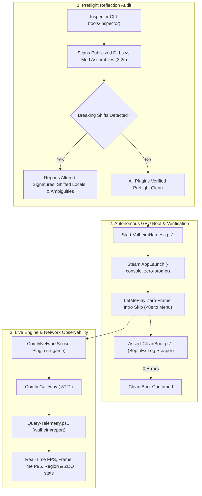

# Deep North Testing (Valheim 1.0)
> **Autonomous GPU-Enabled Test Harness, Preflight Reflection Audits, Sub-8-Second Boot Loops, & Live Telemetry for Valheim Modding.**

[-blue.svg)](#)
[](#)
[](#)
[-success.svg)](#)

---

## 🌟 The Vision

Modding Valheim has traditionally relied on slow, manual feedback loops: launch through Steam, wait 4 minutes through unskippable cinematics, load into a world, read log files after crashes, kill the game, and guess why a Harmony transpiler broke.

**Deep North Testing** provides a reproducible, GPU-enabled automation harness running on sovereign local hardware (**OMEN**: Core Ultra 9 285K, Dual Intel Arc Pro B70 GPUs). It turns mod testing into a programmatic, measurable engineering discipline:

| Traditional Mod Testing | Deep North Automation Harness |
| :--- | :--- |
| ❌ 4-minute unskippable startup intro cinematics | ⚡ **Sub-8-second direct boot loop to interactive Main Menu** |
| ❌ Interactive Steam launch confirmation popups | ⚡ **Direct programmatic Steam AppLaunch without modal interrupts** |
| ❌ Manual crash debugging after game load | ⚡ **3-second Cecil reflection audit before the game even starts** |
| ❌ Guessing in-game render performance | ⚡ **Live in-game GPU & network telemetry streaming at ~60 FPS** |
| ❌ Manual inspection of thousands of log lines | ⚡ **Automated zero-error assertion script (exits 0 on clean boot)** |

---

## 🏗️ Architecture



---

## 🚀 Quickstart

### 1. Run the Preflight Reflection Audit
Audits all installed plugins against Valheim 1.0 game assemblies in under 4 seconds:
```powershell
dotnet run --project tools/Inspector/Inspector.csproj
```

### 2. Launch Valheim with the Fast Boot Loop
Bypasses Steam modals and intro cinematics, launching directly to the menu in <8 seconds:
```powershell
.\harness\Start-ValheimHarness.ps1 -ClearLogs
```

### 3. Assert a Clean Boot
Scrapes `BepInEx/LogOutput.log` to assert that zero errors, exceptions, or patch failures occurred:
```powershell
.\harness\Assert-CleanBoot.ps1
```

### 4. Query Live In-Game GPU Telemetry
Pulls real-time render metrics and engine telemetry directly from the live game session:
```powershell
.\harness\Query-Telemetry.ps1
```

*Example Live Output:*
```text
[OK] Live Connection Established to ComfyNetworkSense
  - Session ID    : 20260912-072730-f5c48c83
  - Mode          : Solo
  - Region / Area : 0:0
  - Total Samples : 30

--- Real-Time GPU and Engine Metrics ---
  - Instant FPS   : 59.99
  - Avg FPS       : 56.42
  - Frame Time    : 16.67 ms
  - Frame Time P95: 18.38 ms
  - CPU Bound Est : 0.6%
```

---

## 🔬 Case Study: Auditing 51 ComfyMods for Valheim 1.0

We pointed this harness at the complete 51-mod suite from [Redseiko's ComfyMods](https://github.com/redseiko/ComfyMods) on branch `feature/valheim-1.0-deep-north`:

- **41 Mods** passed verification without functional modifications.
- **10 Mods** encountered breaking changes and were remediated:
  - `PartyRock`: Sector coordinate narrowing (`Vector2i` $\rightarrow$ `Vector2s`) & `RPC_ZDOData` local index shift (`V_13` $\rightarrow$ `V_12`).
  - `LicenseToSkill`: `SEMan.AddStatusEffect` added 5th `Int16 variant` parameter.
  - `SearsCatalog`: Disambiguated `PieceTable.SetCategory` overloads; graceful no-op on removed mouse scroll wheel.
  - `Silence`: Handled modern Roslyn local function compiler lowering (`<OnNewChatMessage>g__...|0`).
  - `Shortcuts`: Handled reversed keycode check order in `GameCamera.UpdateMouseCapture`.
  - `ContentsWithin`: Handled `TakeInput` local variable shift and `InventoryGui.Show` active group parameter.
  - `Recipedia`: Replaced fragile container hold transpiler with clean `UseButtonHeld()` postfix.
  - `BetterZeeRouter` & `PaperTrail`: Added defensive fallback against early uninitialized `PlatformManager.DistributionPlatform` NRE.
  - `LetMePlay`: Multi-layer startup intro cinematic bypass (<8s boot).

See our complete documentation:
- 📖 [**Valheim 1.0 Mod Migration Guide**](./docs/VALHEIM_1.0_MIGRATION_GUIDE.md) — Comprehensive guide to the 6 core architectural shifts, before/after code snippets, and transpiler rules.
- 📊 [**ComfyMods Full Audit Matrix**](./docs/COMFYMODS_AUDIT_MATRIX.md) — Complete 51-mod status table and verification logs.
- 📈 [**Final Verification Stats & Telemetry**](./stats/final_stats.md) ([JSON](./stats/final_stats.json)) — Quantitative benchmarks, latency reductions, and telemetry data.
- 🎙️ [**2-Hour Podcast Companion Series**](./podcast/README.md) — Exhaustive 6-chapter audio script covering the voyage from silicon to bytecode.

---

## 💻 Test Hardware & Environment

- **Host Machine**: OMEN Workstation
- **Processor**: Intel Core Ultra 9 285K (24 cores)
- **Graphics Silicon**: Dual Intel Arc Pro B70 GPUs (Driver `32.0.101.8974`)
- **Memory**: 64 GB DDR5
- **OS**: Windows 11 Pro 64-bit
- **Valheim**: Version 1.0 (Deep North release, Steam App ID 892970)
- **Mod Loader**: BepInEx 5.4.2202 with HarmonyX 2.14 / 2.16

---

## 📜 License & Acknowledgments

- Harness tools and guides released under the MIT License.
- Special thanks to [redseiko](https://github.com/redseiko) for the exceptional architecture of the ComfyMods ecosystem.
