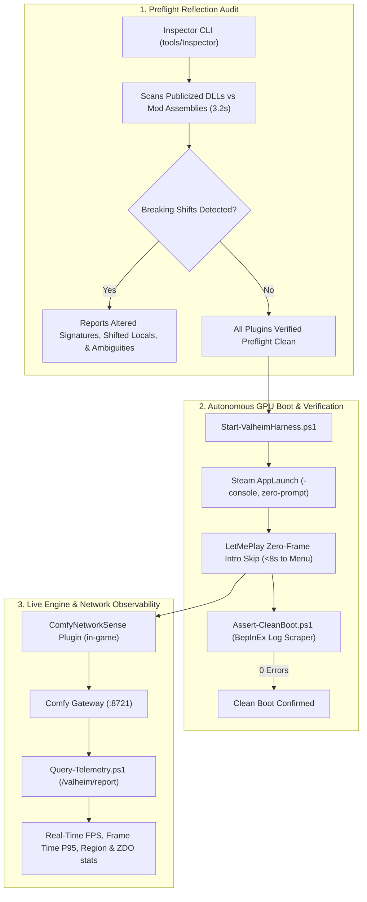
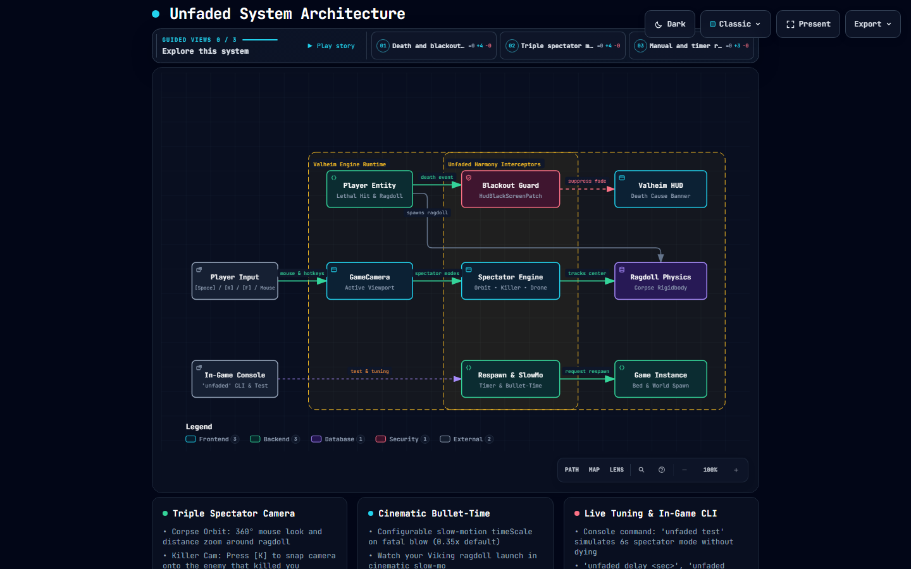

# Deep North Testing (Valheim 1.0)
> **Autonomous GPU-Enabled Test Harness, Preflight Reflection Audits, Sub-8-Second Boot Loops, & Live Telemetry for Valheim Modding.**

[-blue.svg)](#)
[](#)
[](#)
[-success.svg)](#)
[](#-interactive-archify-system-maps)

---

## 📑 Table of Contents

- [🌟 The Vision](#-the-vision)
- [🏗️ Test Harness Architecture](#️-test-harness-architecture)
- [🗺️ Interactive Archify System Maps](#️-interactive-archify-system-maps)
  - [1. Backpack Status Effect Architecture (FAQ-001)](#1-backpack-status-effect-architecture-faq-001)
  - [2. Unfaded Death Spectator & Blackout Removal](#2-unfaded-death-spectator--blackout-removal)
- [🧩 Sovereign Mod Plugins](#-sovereign-mod-plugins)
  - [Unfaded (Death Spectator & Blackout Suppression)](#unfaded-death-spectator--blackout-suppression)
  - [Unswayed (Ergonomic Camera & Locomotion Bobbing Stabilizer)](#unswayed-ergonomic-camera--locomotion-bobbing-stabilizer)
  - [EarnYourKeep (Modded Achievement Enabler)](#earnyourkeep-modded-achievement-enabler)
- [🚀 Quickstart & Autonomous Harness](#-quickstart--autonomous-harness)
  - [1. Preflight Reflection Audit](#1-run-the-preflight-reflection-audit)
  - [2. Fast Boot Loop Launcher](#2-launch-valheim-with-the-fast-boot-loop)
  - [3. Clean Boot Log Assertion](#3-assert-a-clean-boot)
  - [4. Live Telemetry Streaming](#4-query-live-in-game-gpu-telemetry)
- [📖 Engineering Documentation Suite](#-engineering-documentation-suite)
- [📓 Operational Testing Workbook](#-operational-testing-workbook)
- [🔬 Case Study: Auditing 51 ComfyMods](#-case-study-auditing-51-comfymods-for-valheim-10)
- [💻 Test Hardware & Environment](#-test-hardware--environment)
- [📜 License & Acknowledgments](#-license--acknowledgments)

---

## 🌟 The Vision

Modding Valheim has traditionally relied on slow, manual feedback loops: launch through Steam, wait 4 minutes through unskippable cinematics, load into a world, read log files after crashes, kill the game, and guess why a Harmony transpiler broke.

**Deep North Testing** provides a reproducible, GPU-enabled automation harness running on sovereign local hardware (**OMEN**: Core Ultra 9 285K, Dual Intel Arc Pro B70 GPUs). It turns mod testing into a programmatic, measurable engineering discipline:

| Traditional Mod Testing | Deep North Automation Harness |
| :--- | :--- |
| ❌ 4-minute unskippable startup intro cinematics | ⚡ **Sub-8-second direct boot loop to interactive Main Menu** |
| ❌ Interactive Steam launch confirmation popups | ⚡ **Direct programmatic Steam AppLaunch without modal interrupts** |
| ❌ Manual crash debugging after game load | ⚡ **3-second Cecil reflection audit before the game even starts** |
| ❌ Guessing in-game render performance | ⚡ **Live in-game GPU & network telemetry streaming at ~60 FPS** |
| ❌ Manual inspection of thousands of log lines | ⚡ **Automated zero-error assertion script (exits 0 on clean boot)** |

---

## 🏗️ Test Harness Architecture



---

## 🗺️ Interactive Archify System Maps

Our system maps are compiled deterministically into standalone, explorable HTML artifacts powered by **Archify**. Open the interactive maps directly in your browser to inspect preset views, trace directed execution routes, and toggle between dark and light themes.

### 1. Backpack Status Effect Architecture (FAQ-001)

Visualizes YAML configuration parsing, literal hash resolution, `ObjectDB` catalog constraints, single equipment slot limitations, and the Harmony companion interceptor.

- 🌐 [**Open Interactive HTML Viewer**](./docs/backpack-effects.architecture.html)
- 📄 [View Typed JSON Specification](./docs/backpack-effects.architecture.json)
- 📖 [Read FAQ-001 Deep Dive](./docs/FAQ.md#faq-001-can-you-stack-multiple-status-effects-on-backpacks-in-smoothbrains-mod)

[](./docs/backpack-effects.architecture.html)

---

### 2. Unfaded Death Spectator & Blackout Removal

Maps the full lifecycle of lethal hits in Valheim 1.0, including HUD blackout suppression (`HudBlackScreenPatch`), triple spectator modes (Corpse Orbit, Killer Cam, Free-Fly Drone), slow-mo bullet-time, and in-game console tuning.

- 🌐 [**Open Interactive HTML Viewer**](./plugins/Unfaded/docs/unfaded-architecture.html)
- 📄 [View Typed JSON Specification](./plugins/Unfaded/docs/unfaded-architecture.json)
- 📦 [Explore Unfaded Source Code](./plugins/Unfaded)

[](./plugins/Unfaded/docs/unfaded-architecture.html)

---

## 🧩 Sovereign Mod Plugins

This repository develops and tests sovereign Valheim 1.0 plugins built for performance, stability, and zero-error game loops:

### [Unfaded](./plugins/Unfaded) (Death Spectator & Blackout Suppression)
- **Eliminates Blackout Canvas**: Suppresses Valheim's 9.5-second black screen canvas fadeout on death.
- **Triple Spectator Modes**:
  - **Corpse Orbit**: 360° mouse look and scroll wheel distance zoom around your ragdoll.
  - **Killer Cam**: Press **[K]** to snap the camera to the creature that struck the killing blow.
  - **Free-Fly Drone**: Press **[F]** to disconnect camera anchors and fly freely across the battlefield.
- **Cinematic Bullet-Time**: Configurable slow-motion timescale (`0.35x` default) upon lethal hit.
- **In-Game CLI**: Type `unfaded test` in the console (`F5`) to test spectator features without dying.

### [Unswayed](./plugins/Unswayed) (Ergonomic Camera & Locomotion Bobbing Stabilizer)
- **Decouples Camera Stride Bounce**: Anchors base camera height to a stabilized ground offset, decoupling it from the 1.0 animated head bone to completely eliminate running vertical bounce.
- **Dungeon Ergonomics & Anti-Crush**:
  - **Min Distance Clamp**: Prevents camera collision raycasts from crushing point-blank against the player's skull in narrow burial crypt corridors.
  - **Adaptive Shoulder Lift**: Gently raises the camera over the Viking's shoulders in low-clearance crypts for clear sightlines.
  - **Dynamic Dungeon FOV**: Automatically widens FOV in cramped dungeons (e.g. +10°–15°) to stabilize peripheral vision and suppress vertigo.
- **Motion Sickness Toolkit**: Configurable camera shake multiplier (`0.0` to `1.0`), sailing ship tilt suppression, continuous vertical damping slider (`0.0` to `1.0`), and live hotkey toggling (`F7`).
- **In-Game CLI**: Type `unswayed status`, `unswayed toggle`, or tune live parameters directly in console.

### [EarnYourKeep](./plugins/EarnYourKeep) (Modded Achievement Enabler)
- **Decoupled Cheat Detection**: Permits earning Steam achievements while playing with BepInEx and mods.
- **Devcommand Bypass**: Configurable override for worlds where admin/creative commands were activated.
- **Watermark Suppression**: Optionally hides the main menu `"Modded"` watermark.

---

## 🚀 Quickstart & Autonomous Harness

### 1. Run the Preflight Reflection Audit
Audits all installed plugins against Valheim 1.0 game assemblies in under 4 seconds:
```powershell
dotnet run --project tools/Inspector/Inspector.csproj
```

### 2. Launch Valheim with the Fast Boot Loop
Bypasses Steam modals and intro cinematics, launching directly to the menu in <8 seconds:
```powershell
.\harness\Start-ValheimHarness.ps1 -ClearLogs
```

### 3. Assert a Clean Boot
Scrapes `BepInEx/LogOutput.log` to assert that zero errors, exceptions, or patch failures occurred:
```powershell
.\harness\Assert-CleanBoot.ps1
```

### 4. Query Live In-Game GPU Telemetry
Pulls real-time render metrics and engine telemetry directly from the live game session:
```powershell
.\harness\Query-Telemetry.ps1
```

*Example Live Output:*
```text
[OK] Live Connection Established to ComfyNetworkSense
  - Session ID    : 20260912-072730-f5c48c83
  - Mode          : Solo
  - Region / Area : 0:0
  - Total Samples : 30

--- Real-Time GPU and Engine Metrics ---
  - Instant FPS   : 59.99
  - Avg FPS       : 56.42
  - Frame Time    : 16.67 ms
  - Frame Time P95: 18.38 ms
  - CPU Bound Est : 0.6%
```

---

## 📖 Engineering Documentation Suite

Our repository hosts a rigorous technical library documenting Valheim 1.0 internal shifts:

| Document | Description | Format |
| :--- | :--- | :--- |
| 📖 [**Valheim 1.0 Mod Migration Guide**](./docs/VALHEIM_1.0_MIGRATION_GUIDE.md) | Authoritative guide to the 6 core architectural shifts, before/after code snippets, and transpiler rules. | Markdown |
| 📊 [**ComfyMods Full Audit Matrix**](./docs/COMFYMODS_AUDIT_MATRIX.md) | Complete 51-mod status matrix and automated reflection verification logs. | Markdown Table |
| ❓ [**Technical FAQ & Knowledgebase**](./docs/FAQ.md) | Engineering answers, IL breakdowns, and operational runbooks (FAQ-001 Backpacks, FAQ-002 Tombstone Timers, FAQ-003 Black Screen on Connect, FAQ-004 Missing Auto-Pickup Notifications, FAQ-005 Run Animation Vertigo & Dungeons). | Markdown + ToC |
| 📓 [**Harness Testing Workbook**](./docs/WORKBOOK.md) | Hands-on labs, sample configs (`Backpacks.yml`, `Unfaded.cfg`), and observable checkpoints. | Markdown Lab Guide |
| 🔭 [**Unfaded Technical Deep Dive**](./plugins/Unfaded/docs/EXPLANATION.md) | In-depth engineering breakdown of blackout suppression, camera transforms, and bullet-time. | Markdown |
| 🛠️ [**Unfaded Hands-On Workbook**](./plugins/Unfaded/docs/WORKBOOK.md) | Interactive lab guide for spectator testing, console tuning, and keybindings. | Markdown |
| 📈 [**Final Verification Stats & Telemetry**](./stats/final_stats.md) | Quantitative benchmarks, latency reductions, and telemetry data ([JSON](./stats/final_stats.json)). | Markdown / JSON |
| 🎙️ [**2-Hour Podcast Companion Series**](./podcast/README.md) | Exhaustive 6-chapter audio script covering the voyage from silicon to bytecode. | Multi-Part Script |

---

## 📓 Operational Testing Workbook

Looking for hands-on verification labs and sample configuration files? Consult the [**Operational Testing Workbook**](./docs/WORKBOOK.md), which includes:

- **Lab 1**: Status effect hash computation & delimiter failure reproduction.
- **Lab 2**: Custom backpack YAML configuration & deploying the Harmony companion patch.
- **Lab 3**: In-game Unfaded spectator CLI testing (`unfaded test`, `unfaded slowmo`).
- **Lab 4**: Fast sub-8s boot loops and zero-error log assertion.
- **Lab 5**: Streaming live GPU telemetry from the dual Intel Arc Pro B70 rig.

---

## 🔬 Case Study: Auditing 51 ComfyMods for Valheim 1.0

We pointed this harness at the complete 51-mod suite from [Redseiko's ComfyMods](https://github.com/redseiko/ComfyMods) on branch `feature/valheim-1.0-deep-north`:

- **41 Mods** passed verification without functional modifications.
- **10 Mods** encountered breaking changes and were remediated:
  - `PartyRock`: Sector coordinate narrowing (`Vector2i` $\rightarrow$ `Vector2s`) & `RPC_ZDOData` local index shift (`V_13` $\rightarrow$ `V_12`).
  - `LicenseToSkill`: `SEMan.AddStatusEffect` added 5th `Int16 variant` parameter.
  - `SearsCatalog`: Disambiguated `PieceTable.SetCategory` overloads; graceful no-op on removed mouse scroll wheel.
  - `Silence`: Handled modern Roslyn local function compiler lowering (`<OnNewChatMessage>g__...|0`).
  - `Shortcuts`: Handled reversed keycode check order in `GameCamera.UpdateMouseCapture`.
  - `ContentsWithin`: Handled `TakeInput` local variable shift and `InventoryGui.Show` active group parameter.
  - `Recipedia`: Replaced fragile container hold transpiler with clean `UseButtonHeld()` postfix.
  - `BetterZeeRouter` & `PaperTrail`: Added defensive fallback against early uninitialized `PlatformManager.DistributionPlatform` NRE.
  - `LetMePlay`: Multi-layer startup intro cinematic bypass (<8s boot).

---

## 💻 Test Hardware & Environment

- **Host Machine**: OMEN Workstation
- **Processor**: Intel Core Ultra 9 285K (24 cores)
- **Graphics Silicon**: Dual Intel Arc Pro B70 GPUs (Driver `32.0.101.8974`)
- **Memory**: 64 GB DDR5
- **OS**: Windows 11 Pro 64-bit
- **Valheim**: Version 1.0 (Deep North release, Steam App ID 892970)
- **Mod Loader**: BepInEx 5.4.2202 with HarmonyX 2.14 / 2.16

---

## 📜 License & Acknowledgments

- Harness tools, guides, and workbook released under the MIT License.
- Special thanks to [redseiko](https://github.com/redseiko) for the exceptional architecture of the ComfyMods ecosystem.
- Special thanks to [blaxxun / Smoothbrain](https://github.com/blaxxun-boop) and [Azumatt](https://github.com/AzumattDev) for their foundational work across the Valheim modding scene.
