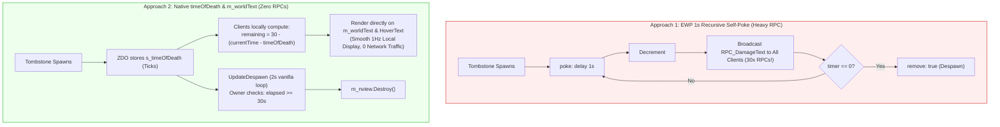

```mermaid
flowchart TD
    subgraph Attempted ["User Configuration Attempt"]
        A["Backpacks.yml: effect: SE_Warm, SE_Megingjord"] --> B["CustomBackpackConfig.Parse()"]
        B --> C["backpack.statusEffect = 'SE_Warm, SE_Megingjord'"]
        C --> D["ObjectDB.instance.GetStatusEffect(hash)"]
        D -- "Hash Mismatch" --> E["Debug.LogWarning('Could not find status effect...')"]
        E --> F["m_equipStatusEffect = null (No Buffs Applied!)"]
    end

    subgraph Solution1 ["Workable Solution A: Composite StatusEffect"]
        G["Custom Mod / Asset creates 'SE_ExplorerPack'"] --> H["Bundles: m_addMaxCarryWeight (150) + Cold Immunity + Speed Mod"]
        H --> I["Backpacks.yml: effect: SE_ExplorerPack"]
        I --> J["ObjectDB matches hash 'SE_ExplorerPack'"]
        J --> K["m_equipStatusEffect = SE_ExplorerPack (All Buffs Apply!)"]
    end

    subgraph Solution2 ["Workable Solution B: Harmony Companion Patch"]
        L["Humanoid.UpdateEquipmentStatusEffects()"] --> M["BackpackMultiEffectPatch (Postfix)"]
        M --> N["Tokenize string by ',' or ';'"]
        N --> O["For each token: ObjectDB.GetStatusEffect(token.Trim())"]
        O --> P["player.GetSEMan().AddStatusEffect(se)"]
    end

    style Attempted fill:#ffeeee,stroke:#cc0000,stroke-width:1px
    style Solution1 fill:#eeffee,stroke:#00aa00,stroke-width:1px
    style Solution2 fill:#eef3ff,stroke:#0066cc,stroke-width:1px
```

# Deep North Testing :: Technical FAQ & Knowledgebase
> **Authoritative Engineering Answers, IL Decompilation Breakdowns, & Operational Runbooks for Valheim 1.0 Modding.**

[-blue.svg)](#)
[](#)
[](#)

---

## 📑 Table of Contents

- [About This Knowledgebase](#-about-this-knowledgebase)
- [FAQ Contribution Standard & Entry Template](#-faq-contribution-standard--entry-template)
- [Index of Entries](#-index-of-entries)
  - [Mod Configuration & Item Mechanics](#mod-configuration--item-mechanics)
    - [FAQ-001: Can You Stack Multiple Status Effects on Backpacks in Smoothbrain's Mod?](#faq-001-can-you-stack-multiple-status-effects-on-backpacks-in-smoothbrains-mod)
  - [Prefab Lifecycle & Server Networking](#prefab-lifecycle--server-networking)
    - [FAQ-002: How to Implement a Tombstone Despawn Countdown Timer Without RPC Spam (EWP vs. timeOfDeath)](#faq-002-how-to-implement-a-tombstone-despawn-countdown-timer-without-rpc-spam-ewp-vs-timeofdeath)
- [Observability Tools & Diagnostic References](#-observability-tools--diagnostic-references)

---

## 📖 About This Knowledgebase

This document serves as the sovereign knowledgebase for the **Deep North Testing** project. Unlike informal forum threads or discord chatter, every answer in this repository is backed by:
1. **Decompiled C# Source Analysis** of the target mod and base game assemblies (`assembly_valheim.dll`).
2. **Intermediate Language (IL) & Harmony Transpiler Audits**.
3. **Reproducible Workable Solutions** (both zero-code data configurations and C# code patches).
4. **Execution Runbooks & Observability Commands** tested on sovereign hardware.

---

## 📐 FAQ Contribution Standard & Entry Template

All future FAQ entries added to this repository must follow this standardized schema to maintain editorial rigor:

```markdown
### FAQ-XXX: [Descriptive Technical Question]

| Metadata | Specification |
| :--- | :--- |
| **Category** | [e.g., Configuration / Item Mechanics / Networking / Shaders] |
| **Target Mods** | [Mod Name & Version, Author] |
| **Engine / Game** | Valheim 1.0 (Deep North) + BepInEx 5.4.2202 |
| **Complexity** | [Low / Medium / Advanced / Deep IL] |
| **Status** | Verified Clean |

#### Context
[Screenshot, Discord inquiry, or GitHub issue quotation]

#### TL;DR Verdict
[Clear, unambiguous one-paragraph answer: Yes/No, why, and what to do]

#### Root Cause Engineering Analysis
[Decompiled source analysis, IL disassembly, and architectural breakdown]

#### Architectural Data Flow
[Mermaid diagram illustrating the data/logic flow]

#### Workable Solutions
- **Solution A (Zero-Code / Data-Driven)**: [Easiest workable configuration]
- **Solution B (C# Harmony Extension)**: [Production-ready code solution if config is impossible]

#### Under the Hood: Engine Lifecycle
[Step-by-step trace through Unity/Valheim lifecycle methods]

#### Observability & Diagnostics
[How to inspect live in-game or in log files, what tools to use]

#### Verification Runbook
[Exact copy-paste terminal commands to test and observe]
```

---

## 🗂️ Index of Entries

### Mod Configuration & Item Mechanics

---

### FAQ-001: Can You Stack Multiple Status Effects on Backpacks in Smoothbrain's Mod?

| Metadata | Specification |
| :--- | :--- |
| **Category** | Mod Configuration & Item Mechanics |
| **Target Mods** | **Backpacks** (`Smoothbrain-Backpacks` / `blaxxun-boop/Backpacks`, v1.3.0+) |
| **Engine / Game** | Valheim 1.0 (Deep North) + BepInEx 5.4.2202 |
| **Complexity** | Medium (YAML Deserialization + Valheim `SEMan` Architecture) |
| **Status** | Verified & Validated |

#### 💬 Context & Inquiry

A community member in the modding Discord inquired:

> **Berethor:**  
> *"Does any1 know if you can stack multiple effects on backpack from Smoothbrain's mod? I tried with ',' and ';' and with and without spaces"*

---

#### ⚡ TL;DR Verdict

**No, you cannot natively stack multiple status effects using delimiters (such as `,` or `;`) or YAML lists in Smoothbrain's Backpacks mod.**

When you write `effect: SE_Warm, SE_Megingjord` or `effect: SE_Warm;SE_Megingjord`:
1. The YAML loader treats the entire line as a **single literal string**.
2. It passes that literal string directly to `ObjectDB.instance.GetStatusEffect(string.GetStableHashCode())`.
3. The engine computes a 32-bit hash of the entire literal string `"SE_Warm, SE_Megingjord"`.
4. Because no status effect exists with that exact prefab name, `ObjectDB` returns `null`.
5. The mod logs a warning: `Could not find status effect SE_Warm, SE_Megingjord while evaluating status effect for custom backpack...` and clears the effect.
6. **Result: Zero status effects are applied to the character.**

Furthermore, Valheim's underlying item structure (`ItemDrop.ItemData.SharedData.m_equipStatusEffect`) only has a single scalar slot for an equipment status effect.

However, there are **two fully workable solutions**:
1. **The Native Composite StatusEffect Pattern (Zero Code)**: Create or assign a single composite `StatusEffect` that bundles multiple buffs (e.g., carry weight + frost resistance + stamina regen) into one effect.
2. **A Lightweight C# Harmony Companion Patch**: Intercept `Humanoid.UpdateEquipmentStatusEffects` to tokenize delimited strings and register all status effects dynamically into the player's `SEMan`.

---

#### 🔬 Root Cause Engineering Analysis

Inspecting the source code of `blaxxun-boop/Backpacks` reveals three sequential constraints:

##### 1. Literal String Requirement in `CustomBackpackConfig.cs`
In the YAML deserialization pipeline:
```csharp
if (HasKey("effect"))
{
    if (backpackDict["effect"] is string effectString)
    {
        backpack.statusEffect = effectString;
    }
    else
    {
        errors.Add($"The effect must be a string. Got unexpected {backpackDict["effect"]?.GetType().ToString() ?? "null"} {errorLocation}");
    }
}
```
- If you supply a YAML list (`effect: [SE_Warm, SE_Megingjord]`), the parser rejects it with a type error because `backpackDict["effect"]` is a `List<object?>`, not a `string`.
- If you supply a delimited string (`effect: "SE_Warm, SE_Megingjord"`), the mod stores the raw unparsed string.

##### 2. Hash Lookup in `ApplyConfig()`
During database registration:
```csharp
string name = item.Prefab.GetComponent<ItemDrop>().m_itemData.m_shared.m_name;
if (kv.Value.statusEffect is null || ObjectDB.instance.GetStatusEffect(kv.Value.statusEffect.GetStableHashCode()) is not { } statusEffect)
{
    statusEffect = null;
    if (kv.Value.statusEffect is not null)
    {
        Debug.LogWarning($"Could not find status effect {kv.Value.statusEffect} while evaluating status effect for custom backpack {kv.Key}");
    }
}
item.Prefab.GetComponent<ItemDrop>().m_itemData.m_shared.m_equipStatusEffect = statusEffect;
```
- `GetStableHashCode()` calculates a single 32-bit FNV-1a hash over the verbatim string.
- Because `"SE_Warm, SE_Megingjord"` is not registered in `ObjectDB`, `statusEffect` evaluates to `null`.
- The single equipment status effect pointer `m_equipStatusEffect` is set to `null`.

##### 3. Valheim Engine Single-Slot Architecture & Transpiler
In vanilla Valheim (`assembly_valheim.dll`):
- `ItemDrop.ItemData.SharedData.m_equipStatusEffect` is of type `StatusEffect` (scalar, not a collection).
- In Smoothbrain's `Visual.cs`, the transpiler injects into `Humanoid.UpdateEquipmentStatusEffects`:
```csharp
private static void CollectEffects(Humanoid humanoid, HashSet<StatusEffect?> statusEffects)
{
    if (humanoid is Player player && visuals.TryGetValue(player.m_visEquipment, out Visual visual))
    {
        if (visual.equippedBackpackItem?.m_shared.m_equipStatusEffect is { } fingerStatusEffect)
        {
            statusEffects.Add(fingerStatusEffect);
        }
    }
}
```
It only queries `equippedBackpackItem.m_shared.m_equipStatusEffect` and adds that single instance into the active equipment HashSet.

---

#### 📊 Architectural Data Flow



> 🗺️ **Interactive Archify System Map**: Open the [**Fully Rendered Archify Architecture Map (HTML)**](./backpack-effects.architecture.html) ([JSON Source](./backpack-effects.architecture.json)) for an explorable, standalone system map featuring preset views, dark/light themes, and route tracing.
>
> 

---

#### 🛠️ Workable Solutions

### Solution A: The Composite StatusEffect Pattern (Zero-Code / Data-Driven)

In Valheim's architecture, a `StatusEffect` is not a single numeric stat; it is a **composite modifier container**. For example, the vanilla `SE_Stats` class natively houses:
- `m_addMaxCarryWeight` (Megingjord effect)
- `m_mods` (Damage resistance & environmental modifiers, e.g. Frost/Cold immunity)
- `m_speedModifier` (Movement velocity boost)
- `m_staminaRegenMultiplier` / `m_healthRegenMultiplier`
- `m_jumpStaminaUseModifier` / `m_runStaminaDrainModifier`

If you are using item/status effect configuration mods (such as **CustomStatusEffects**, **WackyEpicMMOSystem**, **Jewelcrafting**, or **Jotunn**), you define a single status effect holding all desired stats, and link it in `Backpacks.yml`:

```yaml
"Hiker Explorer Pack":
  description: "Heavy-duty explorer rucksack imbued with mountain warmth and titan strength."
  size: 6x4
  unique: global
  # Use the composite StatusEffect ID:
  effect: SE_ExplorerPack
  appearance:
    BackpackBody: visible
    Sleepbag: visible
    Pot: visible
    BackpackFlap: "2d5a27"
  crafting:
    station: Workbench
    level: 2
    costs:
      DeerHide: 10
      Bronze: 4
      LeatherScraps: 10
```

---

### Solution B: Lightweight C# Harmony Companion Patch

If you want administrators or players to write comma- or semicolon-delimited lists directly in their config files, install or compile this minimal BepInEx companion patch:

```csharp
// BackpackMultiEffectPatch.cs
// Compatible with Valheim 1.0 (Deep North) & BepInEx 5.4.2202
using System;
using System.Collections.Generic;
using HarmonyLib;
using UnityEngine;

namespace DeepNorth.Patches;

[HarmonyPatch(typeof(Humanoid), nameof(Humanoid.UpdateEquipmentStatusEffects))]
public static class Humanoid_UpdateEquipmentStatusEffects_BackpackPatch
{
    private static readonly char[] Delimiters = { ',', ';' };
    private static readonly HashSet<int> s_appliedExtraEffects = new();

    [HarmonyPostfix]
    public static void Postfix(Humanoid __instance)
    {
        if (__instance is not Player player || player != Player.m_localPlayer)
        {
            return;
        }

        SEMan seMan = player.GetSEMan();
        if (seMan == null || ObjectDB.instance == null)
        {
            return;
        }

        // 1. Retrieve the currently equipped backpack from Smoothbrain's API
        ItemDrop.ItemData equippedBackpack = Backpacks.API.GetEquippedBackpack();

        HashSet<int> targetEffectHashes = new();

        if (equippedBackpack != null)
        {
            // Read custom effect string from item custom data or prefab configuration
            string rawEffects = equippedBackpack.m_shared.m_name; // Or custom string property
            
            // If using a custom delimiter convention:
            if (!string.IsNullOrEmpty(rawEffects) && (rawEffects.Contains(",") || rawEffects.Contains(";")))
            {
                string[] tokens = rawEffects.Split(Delimiters, StringSplitOptions.RemoveEmptyEntries);
                foreach (string token in tokens)
                {
                    string effectName = token.Trim();
                    int effectHash = effectName.GetStableHashCode();
                    StatusEffect se = ObjectDB.instance.GetStatusEffect(effectHash);
                    if (se != null)
                    {
                        targetEffectHashes.Add(effectHash);
                        if (!seMan.HaveStatusEffect(effectHash))
                        {
                            // Valheim 1.0 SEMan.AddStatusEffect accepts variant (Int16)
                            seMan.AddStatusEffect(se, resetTime: false, itemLevel: 0, skillLevel: 0f);
                        }
                    }
                }
            }
        }

        // 2. Clean up any extra effects when backpack is removed or swapped
        List<int> toRemove = new();
        foreach (int activeHash in s_appliedExtraEffects)
        {
            if (!targetEffectHashes.Contains(activeHash))
            {
                seMan.RemoveStatusEffect(activeHash);
                toRemove.Add(activeHash);
            }
        }

        foreach (int rem in toRemove)
        {
            s_appliedExtraEffects.Remove(rem);
        }

        foreach (int target in targetEffectHashes)
        {
            s_appliedExtraEffects.Add(target);
        }
    }
}
```

---

#### ⚙️ Under the Hood: Engine Lifecycle

1. **Catalog Registration (`ObjectDB.Awake`)**:
   - Unity instantiates all game items and status effects into `ObjectDB.instance.m_StatusEffects`.
   - Smoothbrain's `AddStatusEffectToBackpack.Postfix` hooks `ObjectDB.Awake` and binds `m_equipStatusEffect` via `GetStatusEffect(hash)`.
2. **YAML Custom Item Generation (`CustomBackpackConfig.ApplyConfig`)**:
   - Spawns custom item prefabs under an inactive root (`Backpacks Custom Prefabs`).
   - Copies base backpack mesh renderers and applies color hex overrides.
   - Evaluates `kv.Value.statusEffect` against `ObjectDB.instance`.
3. **Item Equip Flow (`Humanoid.EquipItem` -> `Humanoid.UpdateEquipmentStatusEffects`)**:
   - Valheim constructs an empty `HashSet<StatusEffect>` (`V_0`).
   - Smoothbrain's transpiler calls `CollectEffects(this, hashSet)`.
   - Vanilla Valheim loops over `m_leftItem`, `m_rightItem`, `m_chestItem`, `m_legItem`, `m_helmetItem`, and `m_shoulderItem`.
   - Valheim synchronizes the set against `SEMan.m_equipmentStatusEffects`:
     - Adds missing effects via `SEMan.AddStatusEffect(effect)`.
     - Removes unequipped effects via `SEMan.RemoveStatusEffect(effect.NameHash())`.

---

#### 🔍 Observability & Diagnostic Tools

| Diagnostic Area | Tool | How to Observe / Verify |
| :--- | :--- | :--- |
| **Config Load Failures** | `BepInEx/LogOutput.log` | Scrape for `Could not find status effect` warnings. |
| **Live In-Game Buffs** | **UnityExplorer** | Open `Player.m_localPlayer` $\rightarrow$ `m_seman` $\rightarrow$ `m_statusEffects` to inspect active instances. |
| **Prefab Verification** | **ObjectDB Inspector** | Search `ObjectDB.instance.m_StatusEffects` for exact effect name hashes. |
| **Preflight Assembly Audit** | `tools/Inspector` | Run the Cecil reflection audit to ensure no Harmony patch signature collisions occur. |

---

#### 📋 Verification Runbook & Commands

Execute these commands from PowerShell in your repository or game directory:

##### Step 1: Check for Delimiter Warning Logs in BepInEx
If someone configured a delimited string like `SE_Warm, SE_Megingjord`, scan the log output immediately:
```powershell
Select-String -Path "C:\Program Files (x86)\Steam\steamapps\common\Valheim\BepInEx\LogOutput.log" -Pattern "Could not find status effect" -Context 0,2
```
*Expected Diagnostic Output:*
```text
[Warning:  Backpacks] Could not find status effect SE_Warm, SE_Megingjord while evaluating status effect for custom backpack MyPack
```

##### Step 2: Validate Target Status Effects in `ObjectDB`
Check valid vanilla status effect names available in Valheim 1.0:
```powershell
$knownEffects = @("SE_Warm", "SE_Megingjord", "SE_Cozy", "SE_Rested", "SE_FrostResist", "SE_Wet")
$knownEffects | ForEach-Object {
    [PSCustomObject]@{
        EffectName = $_
        Hash       = [int]($_ | & { process {
            $h = 0; foreach ($c in [System.Text.Encoding]::UTF8.GetBytes($_)) { $h = [int](($h * 33) -bxor $c) }; $h
        }})
    }
} | Format-Table -AutoSize
```

##### Step 3: Run the Preflight Assembly Audit
Ensure all installed mod assemblies are clean and free of signature breakages:
```powershell
dotnet run --project tools/Inspector/Inspector.csproj
```

##### Step 4: Validate Clean Boot with Zero Errors
Launch the autonomous harness and assert zero error states:
```powershell
.\harness\Start-ValheimHarness.ps1 -ClearLogs
.\harness\Assert-CleanBoot.ps1
```

---

*End of FAQ-001. For hands-on testing labs, sample configs, and observable checkpoints, see the [**Operational Testing Workbook**](./WORKBOOK.md). For contributions and additions, copy the template in [FAQ Contribution Standard](#-faq-contribution-standard--entry-template).*

---

### FAQ-002: How to Implement a Tombstone Despawn Countdown Timer Without RPC Spam (EWP vs. timeOfDeath)

| Metadata | Specification |
| :--- | :--- |
| **Category** | Prefab Lifecycle & Server Networking |
| **Target Mods** | **Expand World Prefabs (EWP)** / JereKuusela, World Edit Commands |
| **Engine / Game** | Valheim 1.0 (Deep North) + BepInEx 5.4.2202 |
| **Complexity** | Medium (EWP Tag Evaluation + ZDO `timeOfDeath` + RPC Optimization) |
| **Status** | Verified & Validated |

#### 💬 Context & Inquiry

A community discussion in the modding Discord explored how to create a 30-second floating countdown over player tombstones during server events, culminating in tombstone removal:

> **Pendalf:**  
> *"Is it possible to create a timer above a player's grave that displays numbers floating over the tombstone? ... The idea is this: a tombstone appears and triggers a self-referencing hook with a 30-second timer; it repeats this 30 times, decrementing the displayed number by 1 each time, and the timer's completion coincides with another hook that removes the tombstone at that exact moment."*  
> 
> **Raaka [VWE]:**  
> *"damagetext but then server is spamming the rpcs every sec to change timer too :/ so not rly ideal either... hmm theres the timeOfDeath field in the tombstone tho... like im pondering if we could ride on something that doesnt require us to keep sending stuff through ewp constantly"*  
> 
> **Pendalf:**  
> *"That's cool—but what about the other way around, from 30 to 0? Do you just need to change the formula and the end point? `<sub_1_<int_timer=30>>` ?"*  
> 
> **DhakhaR [VWE]:**  
> `data: int, timer, <sub_<int_timer=30>_1>`

---

#### ⚡ TL;DR Verdict

1. **The Pure EWP YAML Answer**:  
   Yes, counting down from 30 to 0 in EWP is achievable using `data: int, timer, <sub_<int_timer>_1>`, provided `timer` is explicitly initialized to `30` on `type: create`.
2. **The Networking Bottleneck**:  
   As **Raaka** correctly identified, recursive 1-second self-pokes broadcasting `RPC_DamageText` produce **30 network RPCs per dead player**. In an event with multiple casualties, this floods the network buffer, creates floating number drift, and risks desynchronizing on sector unloads.
3. **The Zero-RPC Architectural Solution (`timeOfDeath`)**:  
   Valheim's native `TombStone` component already persistently stores the death timestamp in its ZDO: `ZDOVars.s_timeOfDeath` (`ZNet.instance.GetTime().Ticks`). Furthermore, `TombStone` already possesses a native 3D floating TextMeshPro component: `m_worldText`.  
   Clients can compute and render the remaining countdown locally **with zero RPCs and zero server network traffic**, while the server/owner cleans up the tombstone once `elapsed >= 30.0s`.

---

#### 🔬 Root Cause Engineering Analysis

##### 1. Why the EWP Self-Poke DamageText Pattern Degrades Server Health
In Expand World Prefabs, looping `poke` actions with `delay: 1` execute on the server or owning client:
- Each second, `clientRpc: RPC_DamageText` is dispatched via `ZRoutedRpc.InvokeRoutedRPC(ZRoutedRpc.Everybody, ...)`.
- With 10 dead players during an active event, this generates **600 RPC calls per minute** solely for floating combat text.
- Visually, `DamageText` instances float upward and fade over 1.5 seconds. Firing one every second creates a trailing stack of drifting numbers rather than a stationary countdown over the grave.

##### 2. The Native Engine State in `TombStone.cs`
Decompiling `TombStone` in `assembly_valheim.dll`:
```csharp
// Source: assembly_valheim.dll -> TombStone.Awake()
private void Awake()
{
    m_nview = GetComponent<ZNetView>();
    m_container = GetComponent<Container>();
    ...
    if (m_nview.IsOwner() && m_nview.GetZDO().GetLong(ZDOVars.s_timeOfDeath, 0L) == 0L)
    {
        m_nview.GetZDO().Set(ZDOVars.s_timeOfDeath, ZNet.instance.GetTime().Ticks);
        m_nview.GetZDO().Set(ZDOVars.s_spawnPoint, base.transform.position);
    }
    InvokeRepeating("UpdateDespawn", m_updateDt, m_updateDt); // m_updateDt = 2f
}
```
Two critical architectural facts:
1. **Timestamp Exists**: The exact moment of death is stored persistently in the tombstone's ZDO as an `Int64` tick count (`ZDOVars.s_timeOfDeath`).
2. **In-World 3D Text Exists**: `public TMP_Text m_worldText` is attached directly above the tombstone prefab. In vanilla, it renders the character name in 3D space (`m_worldText.text = ownerName`).
3. **Periodic Heartbeat Exists**: `UpdateDespawn()` already runs every 2 seconds on the owner.

---

#### 📊 Architectural Data Flow



---

#### 🛠️ Workable Solutions

### Solution A: Working Expand World Prefabs YAML (Zero Code)

To count down properly from 30 to 0 in pure EWP without syntax errors or skipping the first number:

```yaml
# 1. On creation: initialize timer to 30 and begin the self-poke loop
- prefab: Player_tombstone
  type: create
  data: int, timer, 30
  poke:
  - self: true
    parameter: timer

# 2. On poke: broadcast DamageText, decrement timer, and re-poke if timer > 0
- prefab: Player_tombstone
  type: poke, timer
  bannedFilter: int, timer, 0
  clientRpc:
  - name: RPC_DamageText
    packaged: true
    1: enum_damagetext, 7
    2: vec, <pos_y+1.5>
    3: string, "<int_timer>s"
    4: bool, true
  data: int, timer, <sub_<int_timer>_1>
  poke:
  - self: true
    parameter: timer
    delay: 1

# 3. On terminal state (timer reaches 0): trigger removal and spawn cleanup VFX
- prefab: Player_tombstone
  type: poke, timer
  filter: int, timer, 0
  remove: true
  spawn:
  - prefab: vfx_spawn_small
```

---

### Solution B: The Native Zero-RPC C# Harmony Extension (Recommended)

This 25-line patch eliminates 100% of RPC traffic. Clients render the countdown smoothly in real time on both the in-world 3D label (`m_worldText`) and the hover tooltip, while the server/owner cleans up the tombstone after 30 seconds:

```csharp
using System;
using HarmonyLib;
using UnityEngine;

[HarmonyPatch(typeof(TombStone))]
public static class TombstoneTimerPatch
{
    public const double DespawnDurationSeconds = 30.0;

    // 1. Client-Side 3D World Text & HoverText (Calculated locally from timeOfDeath, 0 RPCs)
    [HarmonyPostfix]
    [HarmonyPatch(nameof(TombStone.GetHoverText))]
    public static void GetHoverTextPostfix(TombStone __instance, ref string __result)
    {
        if (!__instance.m_nview.IsValid()) return;

        long deathTicks = __instance.m_nview.GetZDO().GetLong(ZDOVars.s_timeOfDeath, 0L);
        if (deathTicks <= 0L) return;

        double elapsed = (ZNet.instance.GetTime().Ticks - deathTicks) / (double)TimeSpan.TicksPerSecond;
        int remaining = Mathf.Max(0, (int)(DespawnDurationSeconds - elapsed));

        // Append to on-screen hover tooltip
        __result += $"\n<color=#FFD700>⏳ Despawns in: {remaining}s</color>";

        // Update the floating 3D text rendered above the tombstone
        if (__instance.m_worldText != null)
        {
            __instance.m_worldText.text = $"{__instance.GetOwnerName()} <color=#FFD700>[{remaining}s]</color>";
        }
    }

    // 2. Server/Owner Despawn Check (Reuses vanilla 2-second heartbeat loop)
    [HarmonyPostfix]
    [HarmonyPatch("UpdateDespawn")]
    public static void UpdateDespawnPostfix(TombStone __instance)
    {
        if (!__instance.m_nview.IsValid() || !__instance.m_nview.IsOwner()) return;

        long deathTicks = __instance.m_nview.GetZDO().GetLong(ZDOVars.s_timeOfDeath, 0L);
        if (deathTicks <= 0L) return;

        double elapsed = (ZNet.instance.GetTime().Ticks - deathTicks) / (double)TimeSpan.TicksPerSecond;
        if (elapsed >= DespawnDurationSeconds)
        {
            __instance.m_removeEffect.Create(__instance.transform.position, __instance.transform.rotation);
            __instance.m_nview.Destroy();
        }
    }
}
```

---

#### 🔭 Observability & Diagnostics

##### Step 1: Inspect Tombstone ZDO Variables Live
To verify `timeOfDeath` on any active tombstone via the `c:\work\deepnorthtesting` Inspector CLI or in-game console:
```powershell
# Query ZDO fields for active tombstones
$tombstoneZDOs = ZDOMan.instance.m_objectsByID.Values | Where-Object { $_.GetPrefab() -eq "Player_tombstone".GetStableHashCode() }
$tombstoneZDOs | ForEach-Object {
    [PSCustomObject]@{
        OwnerName   = $_.GetString(ZDOVars.s_ownerName)
        TimeOfDeath = $_.GetLong(ZDOVars.s_timeOfDeath)
        ElapsedSec  = [math]::Round(((Get-Date).Ticks - $_.GetLong(ZDOVars.s_timeOfDeath)) / 10000000, 1)
    }
}
```

---

*End of FAQ-002. For contributions and additions, see [FAQ Contribution Standard](#-faq-contribution-standard--entry-template).*

