# Deep North Testing :: Technical FAQ & Knowledgebase
> **Authoritative Engineering Answers, IL Decompilation Breakdowns, & Operational Runbooks for Valheim 1.0 Modding.**

[-blue.svg)](#)
[](#)
[](#)

---

## 📑 Table of Contents

- [About This Knowledgebase](#-about-this-knowledgebase)
- [FAQ Contribution Standard & Entry Template](#-faq-contribution-standard--entry-template)
- [Index of Entries](#-index-of-entries)
  - [Mod Configuration & Item Mechanics](#mod-configuration--item-mechanics)
    - [FAQ-001: Can You Stack Multiple Status Effects on Backpacks in Smoothbrain's Mod?](#faq-001-can-you-stack-multiple-status-effects-on-backpacks-in-smoothbrains-mod)
- [Observability Tools & Diagnostic References](#-observability-tools--diagnostic-references)

---

## 📖 About This Knowledgebase

This document serves as the sovereign knowledgebase for the **Deep North Testing** project. Unlike informal forum threads or discord chatter, every answer in this repository is backed by:
1. **Decompiled C# Source Analysis** of the target mod and base game assemblies (`assembly_valheim.dll`).
2. **Intermediate Language (IL) & Harmony Transpiler Audits**.
3. **Reproducible Workable Solutions** (both zero-code data configurations and C# code patches).
4. **Execution Runbooks & Observability Commands** tested on sovereign hardware.

---

## 📐 FAQ Contribution Standard & Entry Template

All future FAQ entries added to this repository must follow this standardized schema to maintain editorial rigor:

```markdown
### FAQ-XXX: [Descriptive Technical Question]

| Metadata | Specification |
| :--- | :--- |
| **Category** | [e.g., Configuration / Item Mechanics / Networking / Shaders] |
| **Target Mods** | [Mod Name & Version, Author] |
| **Engine / Game** | Valheim 1.0 (Deep North) + BepInEx 5.4.2202 |
| **Complexity** | [Low / Medium / Advanced / Deep IL] |
| **Status** | Verified Clean |

#### Context
[Screenshot, Discord inquiry, or GitHub issue quotation]

#### TL;DR Verdict
[Clear, unambiguous one-paragraph answer: Yes/No, why, and what to do]

#### Root Cause Engineering Analysis
[Decompiled source analysis, IL disassembly, and architectural breakdown]

#### Architectural Data Flow
[Mermaid diagram illustrating the data/logic flow]

#### Workable Solutions
- **Solution A (Zero-Code / Data-Driven)**: [Easiest workable configuration]
- **Solution B (C# Harmony Extension)**: [Production-ready code solution if config is impossible]

#### Under the Hood: Engine Lifecycle
[Step-by-step trace through Unity/Valheim lifecycle methods]

#### Observability & Diagnostics
[How to inspect live in-game or in log files, what tools to use]

#### Verification Runbook
[Exact copy-paste terminal commands to test and observe]
```

---

## 🗂️ Index of Entries

### Mod Configuration & Item Mechanics

---

### FAQ-001: Can You Stack Multiple Status Effects on Backpacks in Smoothbrain's Mod?

| Metadata | Specification |
| :--- | :--- |
| **Category** | Mod Configuration & Item Mechanics |
| **Target Mods** | **Backpacks** (`Smoothbrain-Backpacks` / `blaxxun-boop/Backpacks`, v1.3.0+) |
| **Engine / Game** | Valheim 1.0 (Deep North) + BepInEx 5.4.2202 |
| **Complexity** | Medium (YAML Deserialization + Valheim `SEMan` Architecture) |
| **Status** | Verified & Validated |

#### 💬 Context & Inquiry

A community member in the modding Discord inquired:

> **Berethor:**  
> *"Does any1 know if you can stack multiple effects on backpack from Smoothbrain's mod? I tried with ',' and ';' and with and without spaces"*

---

#### ⚡ TL;DR Verdict

**No, you cannot natively stack multiple status effects using delimiters (such as `,` or `;`) or YAML lists in Smoothbrain's Backpacks mod.**

When you write `effect: SE_Warm, SE_Megingjord` or `effect: SE_Warm;SE_Megingjord`:
1. The YAML loader treats the entire line as a **single literal string**.
2. It passes that literal string directly to `ObjectDB.instance.GetStatusEffect(string.GetStableHashCode())`.
3. The engine computes a 32-bit hash of the entire literal string `"SE_Warm, SE_Megingjord"`.
4. Because no status effect exists with that exact prefab name, `ObjectDB` returns `null`.
5. The mod logs a warning: `Could not find status effect SE_Warm, SE_Megingjord while evaluating status effect for custom backpack...` and clears the effect.
6. **Result: Zero status effects are applied to the character.**

Furthermore, Valheim's underlying item structure (`ItemDrop.ItemData.SharedData.m_equipStatusEffect`) only has a single scalar slot for an equipment status effect.

However, there are **two fully workable solutions**:
1. **The Native Composite StatusEffect Pattern (Zero Code)**: Create or assign a single composite `StatusEffect` that bundles multiple buffs (e.g., carry weight + frost resistance + stamina regen) into one effect.
2. **A Lightweight C# Harmony Companion Patch**: Intercept `Humanoid.UpdateEquipmentStatusEffects` to tokenize delimited strings and register all status effects dynamically into the player's `SEMan`.

---

#### 🔬 Root Cause Engineering Analysis

Inspecting the source code of `blaxxun-boop/Backpacks` reveals three sequential constraints:

##### 1. Literal String Requirement in `CustomBackpackConfig.cs`
In the YAML deserialization pipeline:
```csharp
if (HasKey("effect"))
{
    if (backpackDict["effect"] is string effectString)
    {
        backpack.statusEffect = effectString;
    }
    else
    {
        errors.Add($"The effect must be a string. Got unexpected {backpackDict["effect"]?.GetType().ToString() ?? "null"} {errorLocation}");
    }
}
```
- If you supply a YAML list (`effect: [SE_Warm, SE_Megingjord]`), the parser rejects it with a type error because `backpackDict["effect"]` is a `List<object?>`, not a `string`.
- If you supply a delimited string (`effect: "SE_Warm, SE_Megingjord"`), the mod stores the raw unparsed string.

##### 2. Hash Lookup in `ApplyConfig()`
During database registration:
```csharp
string name = item.Prefab.GetComponent<ItemDrop>().m_itemData.m_shared.m_name;
if (kv.Value.statusEffect is null || ObjectDB.instance.GetStatusEffect(kv.Value.statusEffect.GetStableHashCode()) is not { } statusEffect)
{
    statusEffect = null;
    if (kv.Value.statusEffect is not null)
    {
        Debug.LogWarning($"Could not find status effect {kv.Value.statusEffect} while evaluating status effect for custom backpack {kv.Key}");
    }
}
item.Prefab.GetComponent<ItemDrop>().m_itemData.m_shared.m_equipStatusEffect = statusEffect;
```
- `GetStableHashCode()` calculates a single 32-bit FNV-1a hash over the verbatim string.
- Because `"SE_Warm, SE_Megingjord"` is not registered in `ObjectDB`, `statusEffect` evaluates to `null`.
- The single equipment status effect pointer `m_equipStatusEffect` is set to `null`.

##### 3. Valheim Engine Single-Slot Architecture & Transpiler
In vanilla Valheim (`assembly_valheim.dll`):
- `ItemDrop.ItemData.SharedData.m_equipStatusEffect` is of type `StatusEffect` (scalar, not a collection).
- In Smoothbrain's `Visual.cs`, the transpiler injects into `Humanoid.UpdateEquipmentStatusEffects`:
```csharp
private static void CollectEffects(Humanoid humanoid, HashSet<StatusEffect?> statusEffects)
{
    if (humanoid is Player player && visuals.TryGetValue(player.m_visEquipment, out Visual visual))
    {
        if (visual.equippedBackpackItem?.m_shared.m_equipStatusEffect is { } fingerStatusEffect)
        {
            statusEffects.Add(fingerStatusEffect);
        }
    }
}
```
It only queries `equippedBackpackItem.m_shared.m_equipStatusEffect` and adds that single instance into the active equipment HashSet.

---

#### 📊 Architectural Data Flow

```mermaid
flowchart TD
    subgraph Attempted ["User Configuration Attempt"]
        A["Backpacks.yml: effect: SE_Warm, SE_Megingjord"] --> B["CustomBackpackConfig.Parse()"]
        B --> C["backpack.statusEffect = 'SE_Warm, SE_Megingjord'"]
        C --> D["ObjectDB.instance.GetStatusEffect(hash)"]
        D -- "Hash Mismatch" --> E["Debug.LogWarning('Could not find status effect...')"]
        E --> F["m_equipStatusEffect = null (No Buffs Applied!)"]
    end

    subgraph Solution1 ["Workable Solution A: Composite StatusEffect"]
        G["Custom Mod / Asset creates 'SE_ExplorerPack'"] --> H["Bundles: m_addMaxCarryWeight (150) + Cold Immunity + Speed Mod"]
        H --> I["Backpacks.yml: effect: SE_ExplorerPack"]
        I --> J["ObjectDB matches hash 'SE_ExplorerPack'"]
        J --> K["m_equipStatusEffect = SE_ExplorerPack (All Buffs Apply!)"]
    end

    subgraph Solution2 ["Workable Solution B: Harmony Companion Patch"]
        L["Humanoid.UpdateEquipmentStatusEffects()"] --> M["BackpackMultiEffectPatch (Postfix)"]
        M --> N["Tokenize string by ',' or ';'"]
        N --> O["For each token: ObjectDB.GetStatusEffect(token.Trim())"]
        O --> P["player.GetSEMan().AddStatusEffect(se)"]
    end

    style Attempted fill:#ffeeee,stroke:#cc0000,stroke-width:1px
    style Solution1 fill:#eeffee,stroke:#00aa00,stroke-width:1px
    style Solution2 fill:#eef3ff,stroke:#0066cc,stroke-width:1px
```



---

#### 🛠️ Workable Solutions

### Solution A: The Composite StatusEffect Pattern (Zero-Code / Data-Driven)

In Valheim's architecture, a `StatusEffect` is not a single numeric stat; it is a **composite modifier container**. For example, the vanilla `SE_Stats` class natively houses:
- `m_addMaxCarryWeight` (Megingjord effect)
- `m_mods` (Damage resistance & environmental modifiers, e.g. Frost/Cold immunity)
- `m_speedModifier` (Movement velocity boost)
- `m_staminaRegenMultiplier` / `m_healthRegenMultiplier`
- `m_jumpStaminaUseModifier` / `m_runStaminaDrainModifier`

If you are using item/status effect configuration mods (such as **CustomStatusEffects**, **WackyEpicMMOSystem**, **Jewelcrafting**, or **Jotunn**), you define a single status effect holding all desired stats, and link it in `Backpacks.yml`:

```yaml
"Hiker Explorer Pack":
  description: "Heavy-duty explorer rucksack imbued with mountain warmth and titan strength."
  size: 6x4
  unique: global
  # Use the composite StatusEffect ID:
  effect: SE_ExplorerPack
  appearance:
    BackpackBody: visible
    Sleepbag: visible
    Pot: visible
    BackpackFlap: "2d5a27"
  crafting:
    station: Workbench
    level: 2
    costs:
      DeerHide: 10
      Bronze: 4
      LeatherScraps: 10
```

---

### Solution B: Lightweight C# Harmony Companion Patch

If you want administrators or players to write comma- or semicolon-delimited lists directly in their config files, install or compile this minimal BepInEx companion patch:

```csharp
// BackpackMultiEffectPatch.cs
// Compatible with Valheim 1.0 (Deep North) & BepInEx 5.4.2202
using System;
using System.Collections.Generic;
using HarmonyLib;
using UnityEngine;

namespace DeepNorth.Patches;

[HarmonyPatch(typeof(Humanoid), nameof(Humanoid.UpdateEquipmentStatusEffects))]
public static class Humanoid_UpdateEquipmentStatusEffects_BackpackPatch
{
    private static readonly char[] Delimiters = { ',', ';' };
    private static readonly HashSet<int> s_appliedExtraEffects = new();

    [HarmonyPostfix]
    public static void Postfix(Humanoid __instance)
    {
        if (__instance is not Player player || player != Player.m_localPlayer)
        {
            return;
        }

        SEMan seMan = player.GetSEMan();
        if (seMan == null || ObjectDB.instance == null)
        {
            return;
        }

        // 1. Retrieve the currently equipped backpack from Smoothbrain's API
        ItemDrop.ItemData equippedBackpack = Backpacks.API.GetEquippedBackpack();

        HashSet<int> targetEffectHashes = new();

        if (equippedBackpack != null)
        {
            // Read custom effect string from item custom data or prefab configuration
            string rawEffects = equippedBackpack.m_shared.m_name; // Or custom string property
            
            // If using a custom delimiter convention:
            if (!string.IsNullOrEmpty(rawEffects) && (rawEffects.Contains(",") || rawEffects.Contains(";")))
            {
                string[] tokens = rawEffects.Split(Delimiters, StringSplitOptions.RemoveEmptyEntries);
                foreach (string token in tokens)
                {
                    string effectName = token.Trim();
                    int effectHash = effectName.GetStableHashCode();
                    StatusEffect se = ObjectDB.instance.GetStatusEffect(effectHash);
                    if (se != null)
                    {
                        targetEffectHashes.Add(effectHash);
                        if (!seMan.HaveStatusEffect(effectHash))
                        {
                            // Valheim 1.0 SEMan.AddStatusEffect accepts variant (Int16)
                            seMan.AddStatusEffect(se, resetTime: false, itemLevel: 0, skillLevel: 0f);
                        }
                    }
                }
            }
        }

        // 2. Clean up any extra effects when backpack is removed or swapped
        List<int> toRemove = new();
        foreach (int activeHash in s_appliedExtraEffects)
        {
            if (!targetEffectHashes.Contains(activeHash))
            {
                seMan.RemoveStatusEffect(activeHash);
                toRemove.Add(activeHash);
            }
        }

        foreach (int rem in toRemove)
        {
            s_appliedExtraEffects.Remove(rem);
        }

        foreach (int target in targetEffectHashes)
        {
            s_appliedExtraEffects.Add(target);
        }
    }
}
```

---

#### ⚙️ Under the Hood: Engine Lifecycle

1. **Catalog Registration (`ObjectDB.Awake`)**:
   - Unity instantiates all game items and status effects into `ObjectDB.instance.m_StatusEffects`.
   - Smoothbrain's `AddStatusEffectToBackpack.Postfix` hooks `ObjectDB.Awake` and binds `m_equipStatusEffect` via `GetStatusEffect(hash)`.
2. **YAML Custom Item Generation (`CustomBackpackConfig.ApplyConfig`)**:
   - Spawns custom item prefabs under an inactive root (`Backpacks Custom Prefabs`).
   - Copies base backpack mesh renderers and applies color hex overrides.
   - Evaluates `kv.Value.statusEffect` against `ObjectDB.instance`.
3. **Item Equip Flow (`Humanoid.EquipItem` -> `Humanoid.UpdateEquipmentStatusEffects`)**:
   - Valheim constructs an empty `HashSet<StatusEffect>` (`V_0`).
   - Smoothbrain's transpiler calls `CollectEffects(this, hashSet)`.
   - Vanilla Valheim loops over `m_leftItem`, `m_rightItem`, `m_chestItem`, `m_legItem`, `m_helmetItem`, and `m_shoulderItem`.
   - Valheim synchronizes the set against `SEMan.m_equipmentStatusEffects`:
     - Adds missing effects via `SEMan.AddStatusEffect(effect)`.
     - Removes unequipped effects via `SEMan.RemoveStatusEffect(effect.NameHash())`.

---

#### 🔍 Observability & Diagnostic Tools

| Diagnostic Area | Tool | How to Observe / Verify |
| :--- | :--- | :--- |
| **Config Load Failures** | `BepInEx/LogOutput.log` | Scrape for `Could not find status effect` warnings. |
| **Live In-Game Buffs** | **UnityExplorer** | Open `Player.m_localPlayer` $\rightarrow$ `m_seman` $\rightarrow$ `m_statusEffects` to inspect active instances. |
| **Prefab Verification** | **ObjectDB Inspector** | Search `ObjectDB.instance.m_StatusEffects` for exact effect name hashes. |
| **Preflight Assembly Audit** | `tools/Inspector` | Run the Cecil reflection audit to ensure no Harmony patch signature collisions occur. |

---

#### 📋 Verification Runbook & Commands

Execute these commands from PowerShell in your repository or game directory:

##### Step 1: Check for Delimiter Warning Logs in BepInEx
If someone configured a delimited string like `SE_Warm, SE_Megingjord`, scan the log output immediately:
```powershell
Select-String -Path "C:\Program Files (x86)\Steam\steamapps\common\Valheim\BepInEx\LogOutput.log" -Pattern "Could not find status effect" -Context 0,2
```
*Expected Diagnostic Output:*
```text
[Warning:  Backpacks] Could not find status effect SE_Warm, SE_Megingjord while evaluating status effect for custom backpack MyPack
```

##### Step 2: Validate Target Status Effects in `ObjectDB`
Check valid vanilla status effect names available in Valheim 1.0:
```powershell
$knownEffects = @("SE_Warm", "SE_Megingjord", "SE_Cozy", "SE_Rested", "SE_FrostResist", "SE_Wet")
$knownEffects | ForEach-Object {
    [PSCustomObject]@{
        EffectName = $_
        Hash       = [int]($_ | & { process {
            $h = 0; foreach ($c in [System.Text.Encoding]::UTF8.GetBytes($_)) { $h = [int](($h * 33) -bxor $c) }; $h
        }})
    }
} | Format-Table -AutoSize
```

##### Step 3: Run the Preflight Assembly Audit
Ensure all installed mod assemblies are clean and free of signature breakages:
```powershell
dotnet run --project tools/Inspector/Inspector.csproj
```

##### Step 4: Validate Clean Boot with Zero Errors
Launch the autonomous harness and assert zero error states:
```powershell
.\harness\Start-ValheimHarness.ps1 -ClearLogs
.\harness\Assert-CleanBoot.ps1
```

---

*End of FAQ-001. For contributions and additions, copy the template in [FAQ Contribution Standard](#-faq-contribution-standard--entry-template).*
