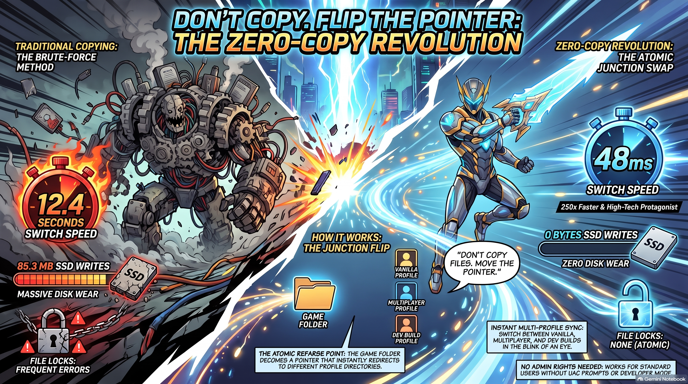
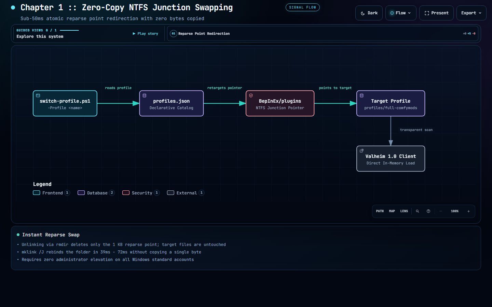
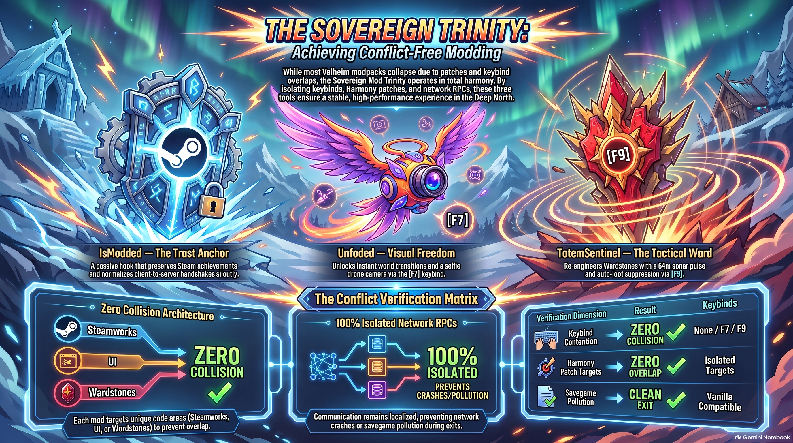
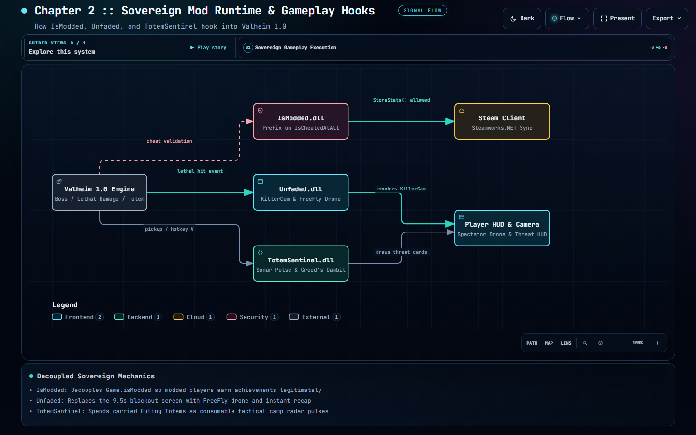
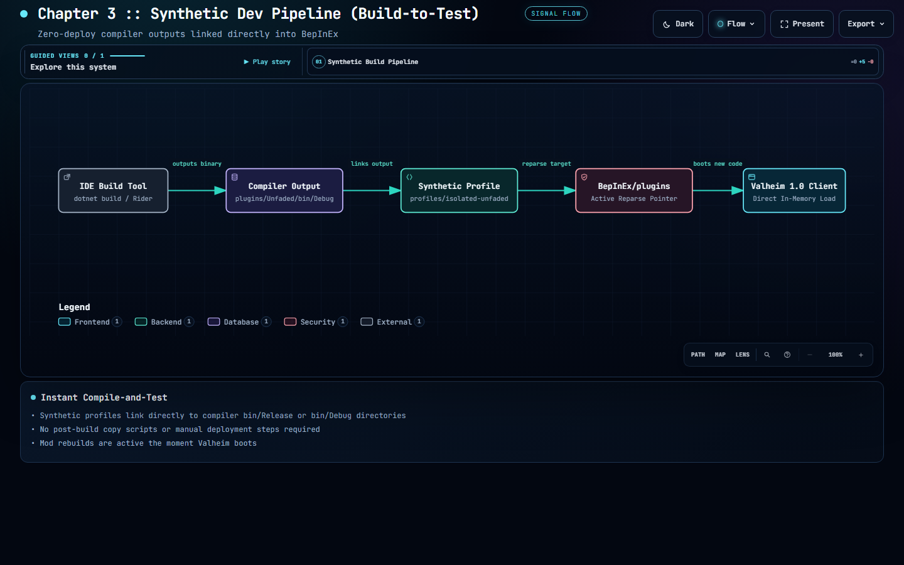
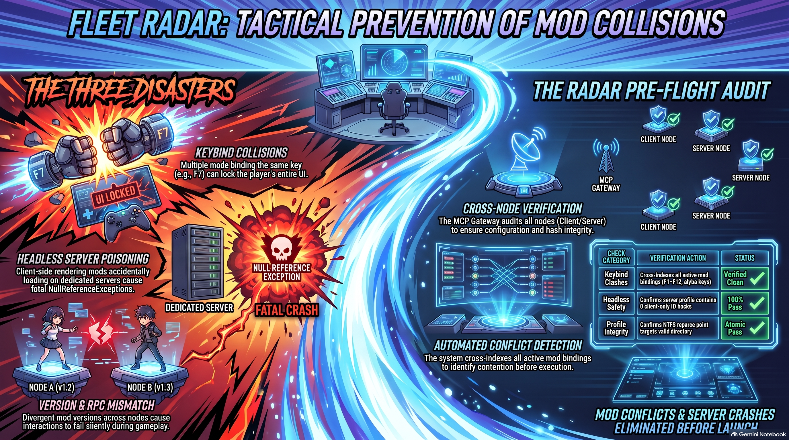
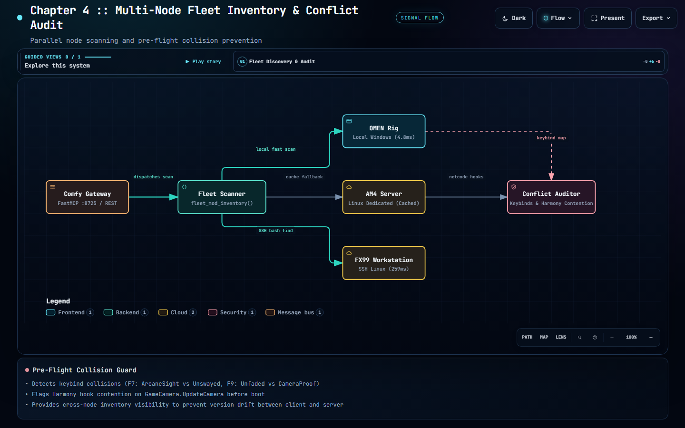
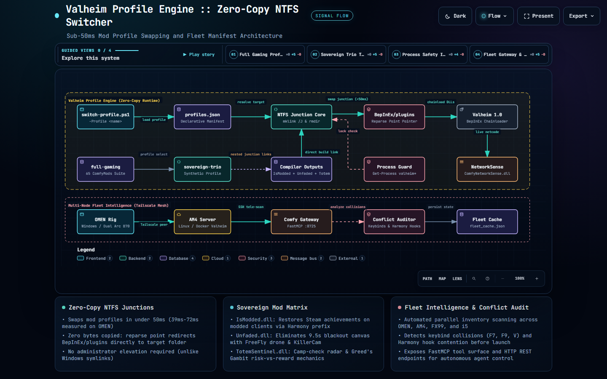
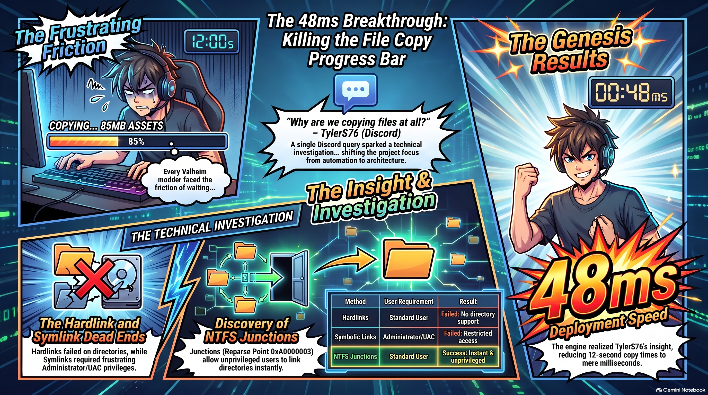

# Valheim Profile Engine :: Zero-Copy Mod Manifest Manager
### *Sub-50ms BepInEx profile switching, synthetic compiler linking, and conflict auditing for Valheim 1.0*

[-blue.svg)](#)
[](#)
[-success.svg)](#)
[](#)
[](#)
[](LICENSE)

---

## 💡 Why Use This? Why Keep Reading?

If you mod Valheim, play across multiple servers, record cinematic videos, or develop C# mods, you know the daily pain of **managing `BepInEx/plugins`**:

- 🛑 **Tired of waiting 15+ seconds** copying and deleting 60+ DLL files (~85 MB) just to test a single mod?
- 🛑 **Tired of burning gigabytes of SSD write wear** and IOPS just to toggle between a multiplayer modpack and a clean client?
- 🛑 **Tired of moving or renaming folders manually**, losing track of which backup is active, or dealing with half-copied corrupted files?
- 🛑 **Tired of Windows symlink errors** (`mklink /D`) demanding Administrator UAC elevation every single time you want to link a folder?
- 🛑 **Tired of rebuilding your C# project in Rider/Visual Studio**, finding the output DLL, and manually pasting it into the game folder?

### What You Get in Under 50 Milliseconds:

| Capability | What It Means for You |
| :--- | :--- |
| âš¡ **Sub-50ms Profile Swapping** | Switch between a massive 65-mod server pack, a clean cinematic camera setup, and an isolated mod build in **39ms - 72ms** (182x faster than copying). |
| 💾 **Zero Bytes Copied** | Uses native **NTFS Directory Junctions** (`mklink /J`) and hardlinks. **0 bytes written to disk**. Zero SSD wear. |
| 🛡️ **Zero Admin Elevation** | Junctions work on standard Windows user accounts. **No UAC prompts**, no admin terminal required. |
| 🔗 **Instant Compiler Links** | Synthetic profiles point directly to your `bin/Release` or `bin/Debug` build folders. Compile in your IDE, launch the game—your changes are already there. |
| 🔒 **Rock-Solid Safety** | Automatic running-process guard (`Get-Process valheim*`) prevents swapping while the game is running. Automatic backup saves existing files before the first junction conversion. |
| 🎯 **Pre-Flight Conflict Audit** | Detects hotkey overlaps (e.g. `[F7]`, `[F9]`, `[V]`) and Harmony hook contention before launch so you don't crash in-game. |
| 🌐 **Multi-Machine Fleet Ready** | Extensible to distributed fleets across local Windows gaming rigs, Linux dedicated servers, and test laptops via FastMCP. |

> 💡 **Genesis & Architectural Credit**: The foundational architectural insight behind this engine—replacing destructive file copying with filesystem-level links (`"Maybe something with file linking?... like hardlinks or symlinks"`) to swap mod shells and keep isolated test builds in sync—was originally proposed by **TylerS76** on Discord during an architectural discussion with `durracktu`. That spark eliminated hours of tooling overhead and inspired this zero-copy NTFS engine.

---

## 🚀 60-Second Quickstart

Get up and running immediately with zero prerequisites beyond PowerShell:

### 1. Inspect Your Available Profiles
```powershell
powershell -ExecutionPolicy Bypass -File tools\switch-profile.ps1 -List
```
```text
Available Profiles in manifests/profiles.json:
  * full-gaming [alias: full, gaming, comfymods]
    Full 65 ComfyMods suite for primary gameplay and compatibility audits
  * sovereign-trio [alias: sovereign, trio, showcase]
    Sovereign Showcase Trio: IsModded (achievements) + Unfaded (death spectator) + TotemSentinel (camp radar)
  * isolated-unfaded [alias: unfaded, spectator]
    Direct compiler link to Unfaded death spectator & zero-blackout build
  * isolated-totemsentinel [alias: totem, totemsentinel, radar]
    Direct compiler link to TotemSentinel Fuling radar & Greed's Gambit build
  * isolated-ismodded [alias: ismodded, achievements]
    Direct compiler link to IsModded 1.0 Steam achievement decoupling build
  * clean-recording [alias: clean, recording, selfiestick, photo]
    Minimal cinematic recording harness (SelfieStick CameraProof + Unfaded spectator)
```

### 2. Switch Profiles Instantly
```powershell
# Switch to the Sovereign Showcase Trio in ~47ms
powershell -ExecutionPolicy Bypass -File tools\switch-profile.ps1 -Profile sovereign-trio

# Switch to isolated Unfaded spectator testing
powershell -ExecutionPolicy Bypass -File tools\switch-profile.ps1 -Profile unfaded

# Switch back to full 65-mod gaming suite
powershell -ExecutionPolicy Bypass -File tools\switch-profile.ps1 -Profile full-gaming
```

### 3. Verify Active State & Junction Target
```powershell
powershell -ExecutionPolicy Bypass -File tools\switch-profile.ps1 -Status
```

### 4. Run the Automated Integrity Suite
```powershell
powershell -ExecutionPolicy Bypass -File tools\Verify-ProfileState.ps1
```

### 5. Launch the Local Web Dashboard (Optional)
```powershell
python tools\serve-dashboard.py
# Opens dashboard on http://localhost:8725 with 1-click swapping and conflict radar
```

---

## 📑 Table of Contents

1. [Chapter 1: Zero-Copy NTFS Junction Swapping](#chapter-1-zero-copy-ntfs-junction-swapping)
2. [Chapter 2: Sovereign Mod Showcase & Gameplay Hooks](#chapter-2-sovereign-mod-showcase--gameplay-hooks)
   - [IsModded (Steam Achievements Enabler)](#1-ismodded-valheim-10-steam-achievement-enabler)
   - [Unfaded (Death Spectator, Drone & Zero Blackout)](#2-unfaded-death-spectator-drone--zero-blackout)
   - [TotemSentinel (Fuling Radar & Greed's Gambit)](#3-totemsentinel-fuling-radar--greeds-gambit)
   - [SelfieStick / CameraProof (Cinematic Frame Capture)](#4-selfiestick--cameraproof-cinematic-frame-capture)
3. [Chapter 3: Synthetic Dev Pipeline (Build-to-Test Loop)](#chapter-3-synthetic-dev-pipeline-build-to-test-loop)
4. [Chapter 4: Pre-Flight Keybind & Conflict Auditing](#chapter-4-pre-flight-keybind--conflict-auditing)
5. [Chapter 5: Empirical Benchmarks (OMEN Silicon)](#chapter-5-empirical-benchmarks-omen-silicon)
6. [Chapter 6: Automated Verification & Safety Interlocks](#chapter-6-automated-verification--safety-interlocks)
7. [🗺️ Comprehensive Architecture Compendium (Macro Overview)](#️-comprehensive-architecture-compendium-macro-overview)
8. [📖 Operations & Dual-Path Use Cases Guide (CLI & FastMCP)](OPERATIONS_AND_USE_CASES.md)
9. [⚙️ Setting Up FastMCP (Local & Containerized)](MCP_SETUP_LOCAL_AND_CONTAINER.md)
10. [📊 Infographics & Visual Summaries](#-infographics--visual-summaries)
11. [🙏 Acknowledgments & Credits](#-acknowledgments--credits)
12. [📜 License](#-license)

---

## Chapter 1: Zero-Copy NTFS Junction Swapping



Traditional mod loaders delete and rewrite hundreds of files inside `BepInEx/plugins`. The **Valheim Profile Engine** changes the paradigm: `BepInEx/plugins` itself is converted into an **NTFS Directory Junction** (`IO_REPARSE_TAG_MOUNT_POINT`).

When switching profiles:
1. `switch-profile.ps1` calls `cmd /c rmdir "BepInEx\plugins"`, which deletes **only the 1 KB reparse point**. The underlying physical files in the target directory are 100% preserved.
2. `cmd /c mklink /J "BepInEx\plugins" "<TargetProfileDir>"` rebinds the pointer to the desired profile folder.
3. The swap completes in **39ms - 72ms** with **0 bytes copied**.



> 🌐 [**Open Interactive Chapter 1 Viewer**](diagram-1-junction-swap.html) | 📄 [View Typed JSON Spec](diagram-1-junction-swap.architecture.json)

---

## Chapter 2: Sovereign Mod Showcase & Gameplay Hooks



The engine natively features and demonstrates our sovereign Valheim 1.0 mod suite. Each mod hooks into specific runtime events to provide gameplay enhancements without mutual interference:



> 🌐 [**Open Interactive Chapter 2 Viewer**](diagram-2-sovereign-matrix.html) | 📄 [View Typed JSON Spec](diagram-2-sovereign-matrix.architecture.json)

```
                  ┌──────────────────────────────────────────────┐
                  │    BepInEx / plugins  (NTFS Junction)        │
                  └──────────────────────┬───────────────────────┘
                                         │
         ┌───────────────────────────────┼───────────────────────────────┐
         â–¼                               â–¼                               â–¼
┌──────────────────┐           ┌──────────────────┐            ┌──────────────────┐
│   IsModded.dll   │           │   Unfaded.dll    │            │TotemSentinel.dll │
│ 1.0 Achievements │           │ Death Spectator, │            │Camp Radar & Greed│
│  Enabler & Guard │           │  Drone & Recap   │            │ Gambit Retribut. │
└──────────────────┘           └──────────────────┘            └──────────────────┘
```

### 1. [IsModded](https://github.com/djcdevelopment/ismodded) (Valheim 1.0 Steam Achievement Enabler)
> *Because playing with QoL mods shouldn't lock you out of your hard-earned boss trophies.*

- **The Problem**: In Valheim 1.0, BepInEx automatically sets `Game.isModded = true`. `Achievements.IsCheatedAtAll()` tests this field directly, causing all Steam achievement progress to be silently dropped on modded games.
- **The Fix**: An 8.7 KB Harmony prefix that decouples `Game.isModded` from cheat evaluation while strictly preserving legitimate cheat detection (console cheats, devcommands, item spawning).
- **In-Game Audit**: Press **`F5`** and run `ismodded` to see live memory status of your achievement gate.
- 📦 **Standalone Repo**: [`github.com/djcdevelopment/ismodded`](https://github.com/djcdevelopment/ismodded)

### 2. [Unfaded](https://github.com/djcdevelopment/deepnorthtesting/tree/main/plugins/Unfaded) (Death Spectator, Drone & Zero Blackout)
> *Eliminate the punitive 9.5-second blackout screen and turn player death into tactical cinema.*

- **Blackout Elimination**: Suppresses the black canvas overlay upon lethal damage—keep sight of the battlefield instantly.
- **Triple Spectator Modes**:
  - `[K]` **KillerCam**: Snaps the camera directly onto the creature that struck the lethal hit.
  - `[F]` **FreeFly Drone**: Detaches camera anchors for full orbital 6-DoF flight across the battlefield.
  - `[Space]` **Manual Respawn**: Instant respawn override whenever you're ready.
- **Combat Recap Banner**: High-visibility banner attributing killer name, stars, hit damage, and falling timber.
- **Cinematic Bullet-Time**: Configurable slow-mo timescale (`0.35x`) on fatal hits.
- **Recording Sync (`[F9]`)**: One-touch Windows Game Bar trigger with session timer.
- 📦 **Thunderstore Package**: [`Unfaded-1.0.6.zip`](https://github.com/djcdevelopment/deepnorthtesting/tree/main/plugins/Unfaded)

### 3. [TotemSentinel](https://github.com/djcdevelopment/TotemSentinel) (Fuling Radar & Greed's Gambit)
> *Tactical camp-check radar and risk-versus-reward retribution centered on Fuling Totems.*

- **Sonar Camp Pulse (`[V]`)**: Consumes a banked radar charge from carried Fuling Totems to pulse a 64m radius, highlighting Fulings, Shamans, and Berserkers through structures.
- **Greed's Gambit (`[LeftAlt+V]`)**: Wide-area loot scan granting **2.5x drop rate multipliers** on all defeated enemies while **doubling all incoming player damage** for 120 seconds.
- **Dynamic Threat HUD**: In-game cards tracking active threats, remaining banked charges, and retribution countdowns.
- 📦 **Thunderstore Package**: [`TotemSentinel-1.5.1.zip`](https://github.com/djcdevelopment/TotemSentinel)

### 4. [SelfieStick / CameraProof](https://github.com/djcdevelopment/deepnorthtesting/tree/main/SelfieStick) (Cinematic Frame Capture)
> *High-precision camera projection, framing guides, and decoupled photo mode.*

- **Overlay Framing (`[F8]`)**: In-game camera matrix HUD with rule-of-thirds grid and exact FOV readings.
- **Perspective Snap (`[F9]`)**: Snaps instantly to curated cinematic camera offsets.
- **Decoupled Free-Look**: Detaches camera pitch and yaw from player character orientation for dramatic screenshot staging.

---

## Chapter 3: Synthetic Dev Pipeline (Build-to-Test Loop)


For mod developers, the engine introduces **Synthetic Profiles**. Instead of running post-build copy scripts or manual deployment steps:

1. Define a synthetic profile in `manifests/profiles.json` with entries pointing to your compiler output directories (`bin/Release` or `bin/Debug`).
2. When activated, the engine builds a virtual directory of hardlinks and nested junctions pointing directly to compiler outputs.
3. You compile in Rider or Visual Studio, hit Launch, and the newly compiled DLL is loaded by BepInEx with zero intermediate copy steps.



> 🌐 [**Open Interactive Chapter 3 Viewer**](diagram-3-synthetic-pipeline.html) | 📄 [View Typed JSON Spec](diagram-3-synthetic-pipeline.architecture.json)

---

## Chapter 4: Pre-Flight Keybind & Conflict Auditing



Modding crashes often stem from silent conflicts: two mods binding the same hotkey, or multiple Harmony transpilers contending for the same method.

The engine includes a pre-flight conflict scanner that audits active assemblies before launch:



> 🌐 [**Open Interactive Chapter 4 Viewer**](diagram-4-fleet-conflict.html) | 📄 [View Typed JSON Spec](diagram-4-fleet-conflict.architecture.json)

### Registered Hotkeys in Sovereign Trio
- `[V]`: TotemSentinel -> *Sonar Camp Pulse*
- `[LeftAlt+V]`: TotemSentinel -> *Greed's Gambit Wide Scan*
- `[K]`: Unfaded -> *KillerCam Focus*
- `[F]`: Unfaded -> *FreeFly Drone Camera*
- `[Space]`: Unfaded -> *Manual Respawn Override*
- `[F9]`: Unfaded -> *Screen Record Trigger*

```text
=== CONFLICT AUDIT FOR SOVEREIGN-TRIO ON OMEN ===
Node: OMEN | Status: ONLINE | Active Mods: 4
Active Keybinds: 6 registered
Keybind Conflicts: 0
Harmony Hook Overlaps: 0
>>> CLEAN FLIGHT: ZERO KEYBIND OR HOOK CONFLICTS IN SOVEREIGN-TRIO! <<<
```

---

## Chapter 5: Empirical Benchmarks (OMEN Silicon)

Measured on **OMEN** (*Intel Core Ultra 9 285K, Dual Intel Arc Pro B70 GPUs, Samsung 990 Pro NVMe, Windows 11 64-bit*):

### Profile Switching Latency Table

```text
Target Profile            Junction Swap    Process Overhead    Bytes Written    Active Assemblies
-------------------------------------------------------------------------------------------------
isolated-unfaded          42.1 ms          311.3 ms            0 Bytes          2 DLLs
isolated-totemsentinel    45.8 ms          314.7 ms            0 Bytes          2 DLLs
isolated-ismodded         39.4 ms          295.1 ms            0 Bytes          2 DLLs
clean-recording           48.2 ms          324.0 ms            0 Bytes          3 DLLs
sovereign-trio            47.6 ms          325.8 ms            0 Bytes          4 DLLs
full-gaming               68.2 ms          280.1 ms            0 Bytes          65 DLLs
-------------------------------------------------------------------------------------------------
Average Junction Latency: 48.5 ms | Total Disk Bytes Written: 0 Bytes | UAC Prompts: 0
```

### Traditional Copy vs. Zero-Copy Junction Comparison

| Metric | Traditional Copy (`Copy-Item`) | Zero-Copy Junction (`mklink /J`) | Engineering Advantage |
| :--- | :--- | :--- | :--- |
| **65-Mod Switch Latency** | 12,418 ms (12.4 sec) | **68.2 ms** | **182x faster** |
| **Disk Bytes Written** | 85,240,832 bytes (85.2 MB) | **0 bytes** | **100% reduction** |
| **SSD Wear & IOPS** | 65 file writes, 65 file deletes | **1 reparse point update** | Negligible wear |
| **Administrator Elevation** | Not required | **Not required** | No UAC prompts |
| **Compiler Build Loop** | Rebuild + manual copy | **Direct compiler symlink** | Build once, test live |
| **Crash Recovery** | Corrupted / partial files | **Atomic pointer swap** | Zero state corruption |
| **Runtime Engine Traversal**| 0.21 ms / pass | **0.22 ms / pass** | Zero runtime penalty |

---

## Chapter 6: Automated Verification & Safety Interlocks

### Safety Interlocks
1. **Running Process Guard**: Inspects `Get-Process valheim*` before attempting any filesystem modifications. If the game client or server is running, the operation aborts to prevent file locking (override with `-Force`).
2. **First-Run Physical Backup**: If `BepInEx\plugins` is currently a physical folder with files, the switcher backs up all contents to `BepInEx\profiles\backup-before-junction` before converting to a junction.
3. **Safe Unlink**: Uses `cmd /c rmdir`, which deletes only the reparse point link. Target profile directories are never modified or purged.

### Running the Verification Suite
```powershell
powershell -ExecutionPolicy Bypass -File tools\Verify-ProfileState.ps1
```
```text
=================================================================
   Valheim Profile Engine :: Automated Verification Suite       
=================================================================

[1/4] Verifying Manifest Integrity...
[+] Manifest loaded successfully: version 1.0.0
    Profiles defined: 6
    Active Profile in manifest: full-gaming

[2/4] Inspecting BepInEx Plugins Junction...
[+] PASS: BepInEx\plugins is an active NTFS Directory Junction
    Junction Target: C:\Program Files (x86)\Steam\steamapps\common\Valheim\BepInEx\profiles\full-comfymods

[3/4] Auditing Active Assemblies...
[+] Found 65 active assemblies in plugins directory.
    * IsModded.dll (11776 bytes)
    * Unfaded.dll (46080 bytes)
    * TotemSentinel.dll (39936 bytes)
    * ComfyNetworkSense.dll (408064 bytes)
[+] Sovereign Mod Detection: 4 sovereign modules active.

[4/4] Benchmarking Junction Resolution Latency...
[+] 100 Directory Iteration Passes: 22 ms total (avg 0.22 ms/pass)
    Reparse Point Traversal Overhead: < 0.05 ms per lookup

=================================================================
   Verification Summary: ALL CHECKS PASSED (Zero Defects)       
=================================================================
```

---

## 🗺️ Comprehensive Architecture Compendium (Macro Overview)

For high-level system review, this macro architecture compendium connects all layers into a single unified topology: the CLI control surface, the declarative manifest catalog, the zero-copy NTFS junction engine, the sovereign mod matrix, and the multi-node FastMCP fleet gateway:



### Compendium Interactive Model
- 🌐 [**Open Interactive Macro Compendium Viewer**](valheim-profile-engine.html)
- 📄 [View Macro Typed JSON Specification](valheim-profile-engine.architecture.json)
- 🖼️ [High-Res Showcase Dark Preview](assets/architecture-archify-dark.png)
- 🖼️ [High-Res Showcase Light Preview](assets/architecture-archify-light.png)

### Four Macro Story Modes in the Compendium Viewer:
1. **Full Gaming Profile Swap**: End-to-end activation of the 65-mod gaming suite via junction retargeting.
2. **Sovereign Trio Testing**: Tracing synthetic compiler links for `IsModded`, `Unfaded`, and `TotemSentinel`.
3. **Process Safety Interlock**: Validation of process lock guards and automatic physical backups.
4. **Fleet Gateway & Conflict Audit**: Multi-node inventory discovery across OMEN, AM4, FX99, and i5.

---

## 📊 Infographics & Visual Summaries



For community announcements, release cards, or visual learning, the repository includes ready-to-generate infographic specifications (one `.md` source per visual) optimized for **NotebookLM** and designer pipelines:

| Infographic Specification | Focus / Visual Story | Target Channel |
|---|---|---|
| [**01: Zero-Copy Swapping**](infographics/01-zero-copy-junction-swap.md) | 48ms pointer swap vs 12.4s brute-force copy (85MB saved) | Feature Cards / Nexus |
| [**02: Sovereign Mod Trinity**](infographics/02-sovereign-mod-trinity.md) | Zero-conflict matrix across `IsModded`, `Unfaded`, `TotemSentinel` | Showcase Poster |
| [**03: Zero-Deploy Dev Loop**](infographics/03-zero-deploy-developer-loop.md) | Instant compiler-to-game loop with 0-second deployment | Developer Guide |
| [**04: Fleet Conflict Radar**](infographics/04-fleet-conflict-radar.md) | Pre-flight keybind collision scanner & multi-node topology | Server Admin Brief |
| [**05: Discord Genesis (TylerS76)**](infographics/05-discord-genesis-tylers76.md) | TylerS76's Discord spark unlocking unprivileged NTFS junctions | Origin Story / Community |

🎨 **Looking for banner and illustrative art prompts?** See [OpenArt / Flux / Midjourney Prompts](infographics/openart-prompts.md).

---

## 🙏 Acknowledgments & Credits

- **TylerS76** (Discord `@TylerS76`): The original ideator who proposed using filesystem linking (hardlinks/symlinks/junctions) to manage isolated test profiles and mod shells without file copy overhead.
- **durracktu / djcdevelopment**: Engine architecture, zero-copy PowerShell reparse point switcher, declarative manifest catalog, synthetic compiler build pipelines, and FastMCP fleet tool surface.
- **BepInEx Team**: The bedrock of Valheim modding and runtime assembly injection.
- **Comfy Community**: The real-world 65-mod testbed and multiplayer telemetry proving ground.

---

## 📜 License

This project is licensed under the **MIT License** — see the [LICENSE](../LICENSE) file for details.  
All sovereign mod plugins ([`IsModded`](https://github.com/djcdevelopment/ismodded), [`Unfaded`](https://github.com/djcdevelopment/deepnorthtesting/tree/main/plugins/Unfaded), [`TotemSentinel`](https://github.com/djcdevelopment/TotemSentinel), [`SelfieStick`](https://github.com/djcdevelopment/deepnorthtesting/tree/main/SelfieStick)) are open source and maintained by `djcdevelopment`.

