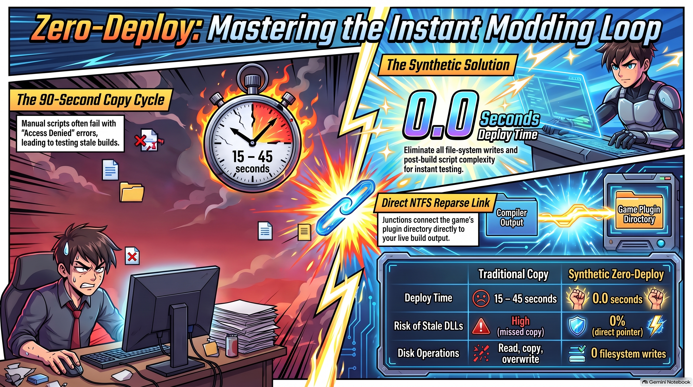

# The Zero-Deploy Dev Loop: From Code Edit to In-Game Test in 0 Seconds



*Illustration / Mood Art:*  


**The traditional Valheim mod dev loop is choked with file copies, post-build scripts, and stale DLLs. Synthetic profiles eliminate deployment entirely.**

---

## The Bottleneck: The 90-Second Copy Cycle

1. **Write Code**: Edit your C# patch or UI logic in your IDE.
2. **Compile**: MSBuild generates your `.dll` in `bin/Release/`.
3. **Copy (Friction)**: Post-build script attempts to copy the DLL into Valheim's `BepInEx/plugins/`.
4. **File Locked!**: Game is still closing or BepInEx holds a handle — copy fails with `Error 5: Access Denied`.
5. **Confusion**: Developer launches game, tests bug, and realizes they are running yesterday's stale build.

---

## The Solution: The Synthetic Profile

```
+------------------+         +----------------------+         +---------------------+
|   IDE / Editor   | ------> |      MSBuild         | ------> |    bin/Release/     |
|  (c:\work\Mod)   |         |                      |         |     (MyMod.dll)     |
+------------------+         +----------------------+         +---------------------+
                                                                         |
                                                            Direct NTFS Reparse Link
                                                                         v
+------------------+         +----------------------+         +---------------------+
|  Valheim Launch  | <------ | BepInEx Game Plugins | <====== |  Synthetic Profile  |
|  (Instant Test)  |         | (Directory Junction) |         |  (Zero Bytes Copied)|
+------------------+         +----------------------+         +---------------------+
```

---

## How It Works in Four Steps

### 1. Build Directly to Local Output
Your project compiles cleanly into its local target folder (`c:\work\Unfaded\bin\Release\net48\`). No custom copy scripts required.

### 2. Map the Synthetic Profile
The Valheim Profile Engine defines a `synthetic` profile in `profiles.json` that junctions the game's plugin directory directly to your compiler output.

### 3. Switch in 48 Milliseconds
Run `switch-profile.ps1 -Profile synthetic`. The NTFS junction instantly connects the game to your live build output.

### 4. Zero Deployment Overhead
When you compile again, the game's plugin directory is *already* pointing to the new binary. The deploy step is literally 0 milliseconds.

---

## The Efficiency Metrics

| Development Metric | Traditional Build-and-Copy | Synthetic Zero-Deploy |
|---|---|---|
| **Deploy Time** | 15 – 45 seconds | **0.0 seconds** |
| **Disk Operations** | Read, copy, overwrite | **0 filesystem writes** |
| **Risk of Stale DLLs** | High (missed copy step) | **0% (direct pointer to output)** |
| **Post-Build Script Complexity** | Fragile batch / PowerShell | **None required** |

---

## The Takeaway

> **Code. Compile. Launch. Stop moving files by hand.**
