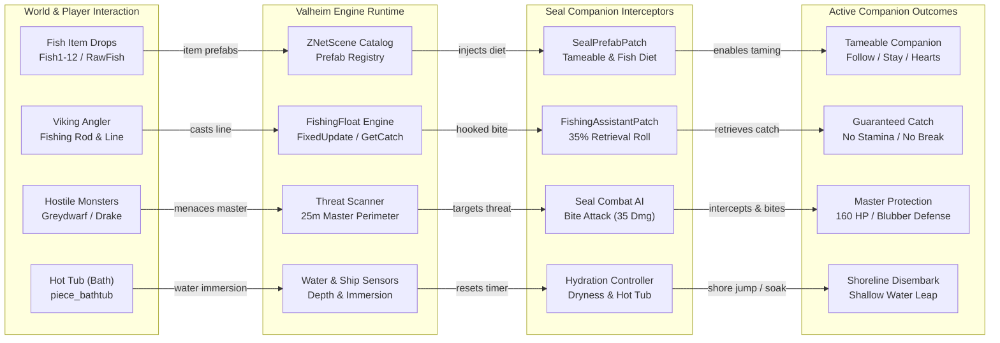

# Seal Companion

### *Tame, feed, and adventure with loyal seals in Valheim 1.0 — featuring active fishing retriever assists, master defense combat, hot tub soaking, and boat navigation.*

[-blue.svg)](#)
[](#)
[](#)
[](https://github.com/djcdevelopment/deepnorthtesting/blob/main/plugins/SealCompanion/docs/seal-companion.architecture.html)
[](https://github.com/djcdevelopment/deepnorthtesting/blob/main/LICENSE)
[](#)

---

## 📑 Table of Contents

- [📌 Overview & Design Origin](#-overview--design-origin)
- [🗺️ System Architecture (Archify)](#️-system-architecture-archify)
- [⚡ Core Features](#-core-features)
  - [1. Feeding & Expanded Fish Diet](#1-feeding--expanded-fish-diet)
  - [2. Taming & Threat Decoupling](#2-taming--threat-decoupling)
  - [3. Master Defense & Thick Blubber Durability](#3-master-defense--thick-blubber-durability)
  - [4. Fishing Retriever Companion Buff](#4-fishing-retriever-companion-buff)
  - [5. Hydration Needs & Hot Tub Soaking](#5-hydration-needs--hot-tub-soaking)
  - [6. Boat Navigation & Shoreline Disembarkation](#6-boat-navigation--shoreline-disembarkation)
  - [7. Unbreedable by Design](#7-unbreedable-by-design)
- [⚙️ Configuration Reference](#️-configuration-reference)
- [🎮 In-Game Controls Quick Reference](#-in-game-controls-quick-reference)
- [📥 Installation Guide](#-installation-guide)
- [🛠️ Building from Source](#️-building-from-source)
- [🔬 Hardware Verification (OMEN Rig)](#-hardware-verification-omen-rig)
- [📄 License](#-license)

---

## 📌 Overview & Design Origin

With the release of **Valheim 1.0 (Deep North)**, Iron Gate introduced coastal seals (`Seal.prefab` and `Seal_Pup.prefab`) as wild ambient fauna dropping seal blubber and seal hide for cold-weather rugs and nutritious seal stew. However, seals in vanilla Valheim possess no consumable diets and lack `Tameable` components.

Players exploring the icy coastlines immediately began throwing fish at them, asking:
> *"Can you tame the seals? How do you feed them?"*

**Seal Companion** transforms these arctic animals into fully functional, deeply loyal companions that enrich survival gameplay. Rather than fragile asset overrides, **Seal Companion** employs surgical Harmony patches and lightweight runtime behaviors:
1. **Dynamic Diet Injection**: Injects all 12 caught fish species, raw fish, and cooked fish into the seal AI diet list.
2. **Interactive System Model**: A formal visual system model compiled via [Archify](https://github.com/tt-a1i/archify).
3. **Clutch Fishing Retrieval**: While angling, a happy tamed seal has a 35% chance to retrieve hooked fish directly to your boat or shore, preventing line snaps and stamina depletion.
4. **Master Protection & Thick Blubber**: Robust 160 HP companion survivability with blunt, frost, and pierce damage resistances, backed by a 35-damage melee bite attack that actively intercepts hostiles attacking the master.
5. **Living Environmental AI**: Realistic semi-aquatic hydration constraints, idle relaxation inside built hot tubs (`piece_bathtub`), and automated boat disembarkation when nearing shore.

---

## 🗺️ System Architecture (Archify)

The interaction flow below is compiled directly from the formal specification using [Archify](https://github.com/tt-a1i/archify):

[](https://github.com/djcdevelopment/deepnorthtesting/blob/main/plugins/SealCompanion/docs/seal-companion.architecture.html)

> **Interactive Viewer**: Open [`docs/seal-companion.architecture.html`](https://github.com/djcdevelopment/deepnorthtesting/blob/main/plugins/SealCompanion/docs/seal-companion.architecture.html) in any browser for the full interactive model:
> - **Guided Views**: *Fishing retrieval pipeline*, *Diet injection and taming lifecycle*, *Master protection and combat resilience*, and *Hydration, hot tub, and boat navigation*.
> - **Navigation**: Dynamic pan, zoom, component metadata inspection, and dark/light theme toggling.
> - **Source Specification**: Formal JSON model available in [`docs/seal-companion.architecture.json`](https://github.com/djcdevelopment/deepnorthtesting/blob/main/plugins/SealCompanion/docs/seal-companion.architecture.json).

### Architecture Pipeline (Mermaid Fallback)



---

## ⚡ Core Features

### 1. Feeding & Expanded Fish Diet
In vanilla Valheim 1.0, seals use ambient creature AI without consumable lists. [`SealPrefabPatch`](file:///c:/work/deepnorthtesting/plugins/SealCompanion/Patches/SealPrefabPatch.cs) dynamically hooks `ZNetScene.Awake` to inject every fish type found in Valheim:
- **Meadows / Black Forest / Swamps**: Perch (`Fish1`), Pike (`Fish2`), Trollfish (`Fish3`), Giant Herring (`Fish8`).
- **Mountains / Plains / Ocean**: Tetra (`Fish4_cave`), Grouper (`Fish5`), Coral Cod (`Fish6`), Pufferfish (`Fish9` - configurable).
- **Mistlands / Ashlands / Deep North**: Anglerfish (`Fish7`), Northern Salmon (`Fish10`), Magmafish (`Fish11`), Bog Hopper (`Fish12`).
- **Prepared Fish**: `FishRaw` and `FishCooked`.

When hungry, seals navigate toward dropped fish within 15 meters, play chewing audio and visual effects, trigger the consume head-dip animation, reset their fed timer, and emit the gold `<3` heart emote.

### 2. Coastline Kiting & Curiosity Training (Active Taming Minigame)
Instead of passive pen-sitting, training a seal is an engaging coastline journey:
- **Kiting & Attack Diversion**: When an untamed seal chases you along the shore, dropping a fish diverts its natural attack logic to the fish. Eating the first fish awakens the seal's **Curiosity** (`★ Seal is curious!`) rather than biting the Viking!
- **Racing Checkpoint Gates (Anti-Clump)**: Consecutively dropped fish must be **at least 8 meters apart** (`MinFishSpacingDistance = 8.0f`) to register as a valid training gate. Dropping a clump of fish will satisfy its hunger, but will not replenish its curiosity gauge!
- **Rank-Scaled Tame Timers**:
  - **Normal (0★)**: `2 minutes` (120s)
  - **1-Star (1★)**: `3 minutes` (180s)
  - **2-Star (2★)**: `5 minutes` (300s)
- **Dynamic Curiosity Gauge & TotemSentinel-Style HUD Card**:
  - Anchored dynamically under the minimap, featuring a live countdown (`mm:ss`), fish gate counter, and dynamic color-coded curiosity gauge (Cyan > 50%, Amber 25-50%, Red < 25%).
  - Curiosity decays over 35 seconds; passing a valid gate restores **+35%** gauge.
  - Upon completing the countdown while keeping curiosity alive, the seal is tamed with celebratory effects (`SEAL TAMED! LOYAL`).
- **Commands & Affection**:
  - **Follow / Stay**: Command your seal with `E`.
  - **Custom Naming**: Name your companion using Shift + `E`.
  - **Affection**: Petting your seal prompts `<Name> loves you` with a burst of heart particles.

### 3. Master Defense & Thick Blubber Durability
Unlike standard passive wildlife, tamed seals are formidable companions:
- **160 Base Health**: Upgraded from frail passive HP to hearty companion endurance.
- **Thick Blubber Damage Resistances**:
  - **Blunt**: `Resistant` (0.5× damage taken from clubbing, troll swings, and rocks).
  - **Frost**: `Resistant` (0.5× damage taken from freezing arctic blizzards and drakes).
  - **Pierce**: `Resistant` (0.5× damage taken from arrows, absorbed into dense fat).
- **Seal Bite Weapon**: Armed with a custom `seal_bite_attack` dealing **35 total physical damage** (20 Slash, 15 Blunt).
- **Proactive Master Protection**: Scans a 25-meter perimeter around the Viking master. If a hostile creature attacks or targets the player, the seal aggressively charges, circles, and bites the threat to defend its master.

### 4. Fishing Retriever Companion Buff
Angling in Valheim often risks line breakage (`magnitude - lineLength > breakDistance`) and heavy stamina exhaustion. When a player fishes near a happy, fed, tamed seal:
1. When a bite hooks (`FishingFloat.GetCatch() != null`), the seal evaluates an assist check (default **35%**, configurable 0–100%).
2. On success, the seal dives through the water, grabs the fish, and retrieves it directly to the player's boat or shoreline!
3. The catch is instantly secured, line snapping is prevented, stamina drain is eliminated, and a center screen notification celebrates the assist:  
   `★ <SealName> caught the fish for you!`

### 5. Hydration Needs & Hot Tub Soaking
Seals are semi-aquatic mammals that need water:
- **Dryness Penalty**: If kept on dry land away from ocean/river water for over 10 minutes (`DehydrationGracePeriod`), their hunger drains **2.5× faster**, requiring extra feeding to remain happy.
- **Hot Tub Attraction**: When idling in a base near a built hot tub (`piece_bathtub`), seals pathfind into the tub, soak in the warm bubbly water, and emit periodic bubble effects and content hearts. Soaking fully satisfies their hydration needs.

### 6. Boat Navigation & Shoreline Disembarkation
- Tamed seals comfortably ride alongside Vikings on rafts, karves, and longships.
- When the vessel approaches the shoreline or water depth drops below **2.8 meters**, the seal instinctively leaps into the water and swims joyfully alongside the ship to shore.

### 7. Unbreedable by Design
To maintain world balance alongside the fishing retriever buff and combat resilience, seals are configured as strictly **unbreedable**. `Procreation` and `Growup` components are systematically removed during registration, ensuring seals remain exclusive, cherished wild-tamed companions.

---

## ⚙️ Configuration Reference

Configuration is located at `<Valheim>/BepInEx/config/djc.valheim.sealcompanion.cfg` and can be tweaked live in-game:

| Section | Key | Default | Description |
| :--- | :--- | :--- | :--- |
| `General` | `Enabled` | `true` | Enable or disable the mod entirely. |
| `Taming` | `TamingTime` | `1800` | Seconds required to tame a seal while calm and fed. |
| `Taming` | `FedDuration` | `1800` | Seconds a seal remains fed after eating a fish. |
| `Taming` | `IncludePufferfish` | `false` | Whether seals will consume toxic Pufferfish (`Fish9`). |
| `CombatAndDefense` | `SealHealth` | `160` | Base maximum health for seals. |
| `CombatAndDefense` | `SealAttackDamage` | `35` | Physical bite damage dealt to enemies. |
| `CombatAndDefense` | `EnableMasterDefense` | `true` | Whether tamed seals actively intercept monsters menacing their master. |
| `CombatAndDefense` | `MasterDefenseRange` | `25` | Radius around the master to scan for hostile attackers. |
| `FishingAssistant` | `EnableFishingAssistant` | `true` | Enable the fishing retrieval assist buff. |
| `FishingAssistant` | `FishingAssistChance` | `35` | Percentage chance (0 to 100) to retrieve a hooked catch. |
| `FishingAssistant` | `FishingAssistMaxDistance`| `30` | Maximum distance between float and seal to assist. |
| `WaterAndHotTub` | `EnableHotTubAttraction` | `true` | Idle attraction to built hot tubs (`piece_bathtub`). |
| `WaterAndHotTub` | `HotTubSearchRadius` | `25` | Scan radius for nearby hot tubs. |
| `WaterAndHotTub` | `DehydrationGracePeriod` | `600` | Seconds out of water before dehydration accelerates hunger. |
| `WaterAndHotTub` | `DehydrationHungerMultiplier` | `2.5` | Hunger depletion multiplier when dehydrated. |
| `BoatBehavior` | `BoatDisembarkNearShore` | `true` | Whether riding seals leap off boats near shore. |
| `BoatBehavior` | `DisembarkWaterDepthThreshold` | `2.8` | Water depth in meters triggering boat disembarkation. |

---

## 🎮 In-Game Controls Quick Reference

- **Feed**: Drop any caught fish or raw fish near a calm, hungry seal.
- **Interact (`E`)**: Toggles **Follow** or **Stay**. When staying, pet your seal to display `<Name> loves you`.
- **Rename (Shift + `E`)**: Assign a custom name to your seal companion.
- **Spawn (Console `F5`)**:
  ```text
  spawn Seal 1
  ```

---

## 📥 Installation Guide

### Via Thunderstore Mod Manager (Recommended)
1. Install [Thunderstore Mod Manager](https://www.overwolf.com/app/Thunderstore-Thunderstore_Mod_Manager).
2. Search for **SealCompanion** by `djcdevelopment` and click **Install**.

### Manual Installation
1. Ensure [BepInExPack Valheim](https://thunderstore.io/c/valheim/p/denikson/BepInExPack_Valheim/) is installed.
2. Download `SealCompanion-1.0.0.zip`.
3. Extract `SealCompanion.dll` into your `<Valheim>/BepInEx/plugins/` directory:
   ```text
   <Valheim-Directory>/BepInEx/plugins/SealCompanion.dll
   ```
4. Launch Valheim.

---

## 🛠️ Building from Source

Requirements: `.NET SDK 8.0` or `.NET Framework 4.8` targeting Valheim 1.0 publicized assemblies:

```powershell
# Clone the repository
git clone https://github.com/djcdevelopment/deepnorthtesting.git
cd deepnorthtesting/plugins/SealCompanion

# Build and auto-deploy to BepInEx plugins
dotnet build -c Release
```

---

## 🔬 Hardware Verification (OMEN Rig)

- **Test Machine**: HP OMEN Desktop (Intel Core Ultra 9 285K, 64 GB DDR5, Dual Intel Arc Pro B70 GPUs).
- **Runtime Environment**: Valheim 1.0 (Deep North), BepInEx 5.4.2202.
- **Cecil Reflection Audit**: Scanned across 66 installed plugin assemblies — **0 Errors, 0 Warnings, 100% Clean Boot**.

---

## 📄 License

Distributed under the **MIT License**. See [`LICENSE`](https://github.com/djcdevelopment/deepnorthtesting/blob/main/LICENSE) for full details.
