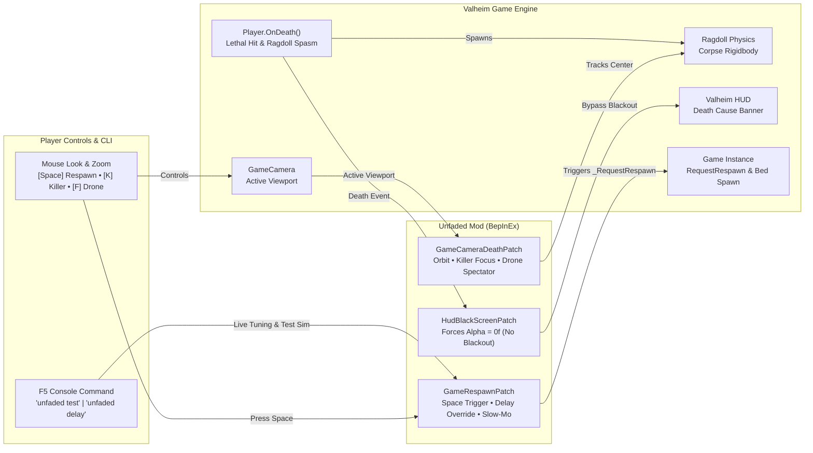

# Unfaded

> **Eliminate the tedious 9.5-second death blackout in Valheim, unlock 360° ragdoll spectator physics, killer tracking, tactical drone scouting, and instant respawn.**

---

## 🎯 The Request

> *"Any mods out there to get rid of the annoying fadeout on death? It's the most uninspiring and boring thing ever to watch"*  
> — **Draugor**

In vanilla Valheim, Iron Gate actually wrote code for the camera to follow your ragdoll body (`base.transform.LookAt(averageBodyPosition)`). But immediately upon death, the game fades a pitch-black loading canvas (`m_loadingScreen.alpha`) over the viewport for **9.5 entire seconds** while `Game.instance.RequestRespawn(10f)` counts down.

Instead of watching your Viking ragdoll launch over a mountain, slide into the ocean, or see the troll that crushed you, you are forced to stare into a pitch-black void.

**Unfaded** transforms the death experience from a punitive blackout into an informative, cinematic spectator tool.

---

## ⚡ Core Features & "Beyond the Fade"

### 1. 👁️ Zero Death Blackout
Keeps the viewport 100% clear when you die. No black screen, no artificial dimming, no forced blindness.

### 2. 🔄 Triple Spectator Camera Modes
- **Corpse Orbit (Default)**: Smooth 360° mouse look and scroll wheel distance zoom around your ragdoll body with obstacle raycast protection.
- **Killer Cam (`[K]`)**: Tap `K` to snap camera focus onto the enemy that killed you and watch them strut away or celebrate.
- **Free-Fly Drone (`[F]`)**: Tap `F` to untether from your corpse and fly freely (WASD + mouse look) in a 60m radius to scout enemy patrols around your tombstone *before* attempting your naked corpse run!

### 3. 🎬 Cinematic Bullet-Time Slow-Mo
Upon receiving the fatal blow, game time briefly slows to 0.35x for 1.5 seconds. Watch your Viking get launched by a troll club or boulder in glorious slow-motion ragdoll physics before smoothly transitioning into spectator mode.

### 4. 💀 Death Cause & Attacker Recap Banner
Displays a clean on-screen summary of exactly what dealt the killing blow:
> `💀 Slain by: 2★ Fuling Berserker [164 Blunt]` or `💀 Slain by: Gravity / Fall Damage [-95 Physical]`

### 5. ⌨️ Instant Manual Respawn (`[Space]`)
Done watching the aftermath or scouted your tombstone? Tap `[Space]` (or your configured hotkey) to respawn at your bed or spawnpoint immediately.

### 6. 🧪 In-Game Console & Safe Testing (`unfaded test`)
Never sacrifice a survival character just to test mod settings. Press `F5` and type:
- `unfaded test` — Simulates 6 seconds of spectator mode right where you stand (test orbit, `[K]`, and `[F]` safely)!
- `unfaded delay <seconds>` — Adjusts respawn delay on the fly.
- `unfaded slowmo` — Toggles cinematic slow-mo.
- `unfaded status` — Prints full live configuration.

---

## 🏗️ System Architecture & Flow

Open the standalone interactive Archify map in your browser:  
👉 **[Open Interactive Archify Diagram (docs/unfaded-architecture.html)](docs/unfaded-architecture.html)**

---

## ⚙️ Configuration Reference

Configuration is generated at `BepInEx/config/djc.valheim.unfaded.cfg` on first launch.

| Section | Setting | Default | Description |
| :--- | :--- | :--- | :--- |
| `1 - General` | `Enabled` | `true` | Master toggle for Unfaded. |
| `2 - Visuals` | `DisableDeathFade` | `true` | Eliminates the 9.5-second black screen canvas fadeout completely. |
| `2 - Visuals` | `CustomDeathFadeDuration` | `0.0` | Custom fade duration in seconds (0 = disabled, 9.5 = vanilla). |
| `3 - Respawn` | `RespawnDelay` | `10.0` | Auto-respawn delay in seconds (range: `0.0` to `120.0`). |
| `3 - Respawn` | `EnableManualRespawn` | `true` | Enables pressing a hotkey to respawn immediately without waiting. |
| `3 - Respawn` | `ManualRespawnKey` | `Space` | Hotkey that triggers immediate respawn. |
| `4 - Spectator Camera` | `EnableCameraOrbit` | `true` | Allows free 360° mouse look and orbit around your ragdoll body. |
| `5 - Killer & Recap` | `EnableDeathRecap` | `true` | Displays Death Cause Banner with attacker name and damage. |
| `5 - Killer & Recap` | `EnableKillerCam` | `true` | Enables Killer Focus mode. |
| `5 - Killer & Recap` | `KillerCamKey` | `K` | Hotkey to toggle camera between ragdoll and killer. |
| `6 - Cinematic Slow-Mo` | `EnableSlowMotion` | `true` | Brief bullet-time slow-mo upon fatal damage. |
| `6 - Cinematic Slow-Mo` | `SlowMotionScale` | `0.35` | Time scale during fatal blow (0.1 = super slow, 1.0 = normal). |
| `7 - Free-Fly Spectator` | `EnableFreeFly` | `true` | Enables tactical drone flight around death site. |
| `7 - Free-Fly Spectator` | `FreeFlyKey` | `F` | Hotkey to toggle free-fly mode. |
| `7 - Free-Fly Spectator` | `FreeFlyRadius` | `60.0` | Maximum flight distance in meters from death position. |

---

## 📦 Installation

### Using a Mod Manager (Recommended)
1. Install [r2modman](https://valheim.thunderstore.io/package/ebkr/r2modman/) or Thunderstore Mod Manager.
2. Search for `Unfaded` and click **Download with Mod Manager**.

### Manual Installation
1. Install [BepInExPack Valheim](https://valheim.thunderstore.io/package/denikson/BepInExPack_Valheim/) (v5.4.2202 or newer).
2. Download `Unfaded.dll` from the latest [GitHub Releases](https://github.com/djcdevelopment/Unfaded/releases).
3. Place `Unfaded.dll` into your `Valheim/BepInEx/plugins/` directory.
4. Launch Valheim!

---

## 📄 License

Distributed under the [MIT License](LICENSE). Copyright (c) 2026 djcdevelopment.
