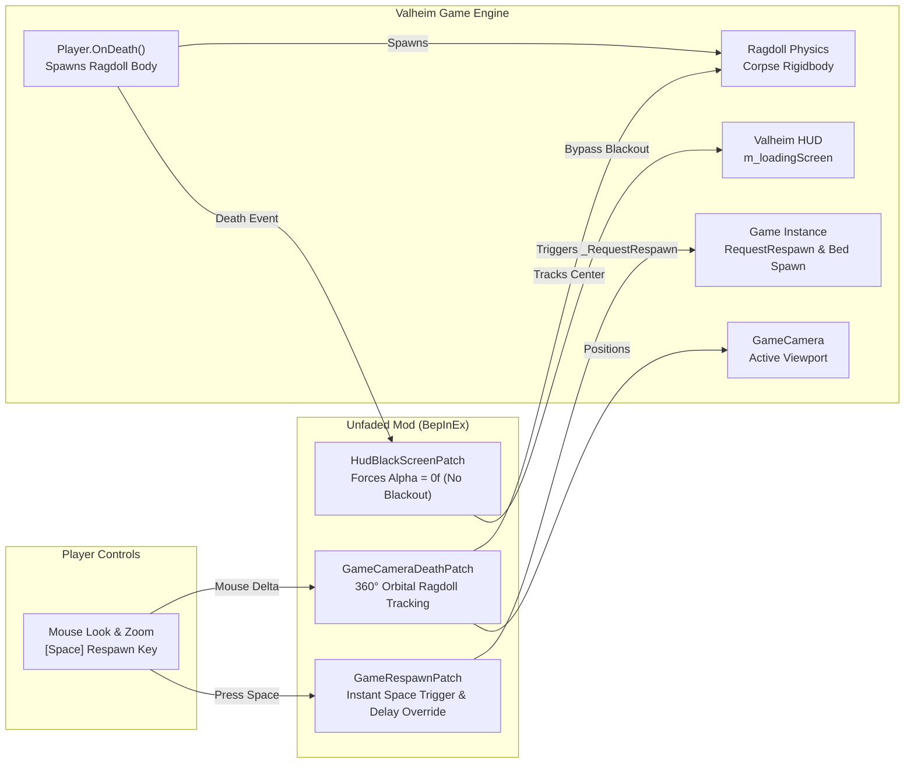

# Unfaded

> **Eliminate the tedious 9.5-second death blackout in Valheim, unlock 360° ragdoll spectator physics, and take control of your respawn.**

[](#)
[](#)
[](LICENSE)
[](#)

---

## 🎯 The Request


> *"Any mods out there to get rid of the annoying fadeout on death? It's the most uninspiring and boring thing ever to watch"*  
> — **Draugor**

In vanilla Valheim, Iron Gate actually wrote code for the camera to follow your ragdoll body (`base.transform.LookAt(averageBodyPosition)`). But immediately upon death, the game fades a pitch-black loading canvas (`m_loadingScreen.alpha`) over the viewport for **9.5 entire seconds** while `Game.instance.RequestRespawn(10f)` counts down.

Instead of watching your Viking ragdoll launch over a mountain, slide into the ocean, or see the troll that crushed you, you are forced to stare into a pitch-black void.

**Unfaded** fixes this completely.

---

## ⚡ Features

- 👁️ **Zero Death Blackout**: Keeps the viewport 100% clear when you die. No black screen, no dimming, no forced blindness.
- 🔄 **360° Orbital Corpse Camera**: Smooth mouse orbit and scroll wheel distance zoom around your ragdoll body. Look in any direction to inspect the battlefield or watch your fellow Vikings avenge you.
- 🛡️ **Terrain Collision Protection**: Built-in sphere-cast collision detection prevents the death camera from clipping through rocks, dungeons, or ground geometry.
- ⌨️ **Instant Manual Respawn (`[Space]`)**: Done watching the aftermath? Tap `[Space]` (or your configured hotkey) to respawn at your bed or spawnpoint immediately.
- ⏱️ **Configurable Auto-Respawn Timer**: Change the default 10-second timer to anything from 0 seconds (instant) to 120 seconds (long spectator mode).
- 🌐 **100% Client-Side Safe**: Runs entirely in client UI and local camera routines. Zero server-side installation required; completely safe on vanilla or modded dedicated multiplayer servers.
- 🧼 **Clean Transition**: Preserves genuine loading screens when you actually arrive at your spawnpoint, teleport, or sleep.

---

## 🏗️ System Architecture & Flow

Open the standalone interactive Archify map in your browser:  
👉 **[Open Interactive Archify Diagram (docs/unfaded-architecture.html)](docs/unfaded-architecture.html)**



---

## ⚙️ Configuration

Configuration is automatically generated at `BepInEx/config/djc.valheim.unfaded.cfg` on first launch. All options can be modified live or via configuration managers.

| Section | Setting | Default | Description |
| :--- | :--- | :--- | :--- |
| `1 - General` | `Enabled` | `true` | Master toggle for Unfaded. |
| `2 - Visuals` | `DisableDeathFade` | `true` | Eliminates the 9.5-second black screen canvas fadeout completely. |
| `2 - Visuals` | `CustomDeathFadeDuration` | `0.0` | Custom fade duration in seconds (0 = disabled, 9.5 = vanilla). |
| `3 - Respawn` | `RespawnDelay` | `10.0` | Auto-respawn delay in seconds (range: `0.0` to `120.0`). |
| `3 - Respawn` | `EnableManualRespawn` | `true` | Enables pressing a hotkey to respawn immediately without waiting. |
| `3 - Respawn` | `ManualRespawnKey` | `Space` | Hotkey that triggers immediate respawn. |
| `3 - Respawn` | `ShowRespawnPrompt` | `true` | Displays on-screen HUD reminder showing the manual respawn hotkey. |
| `3 - Respawn` | `RespawnPromptText` | `Press [{0}] to Respawn` | Message format string displayed on death. |
| `4 - Spectator Camera` | `EnableCameraOrbit` | `true` | Allows free 360° mouse look and orbit around your ragdoll body. |
| `4 - Spectator Camera` | `CameraOrbitSensitivity` | `2.0` | Mouse look sensitivity multiplier while spectating your corpse. |

---

## 📦 Installation

### Using a Mod Manager (Recommended)
1. Install [r2modman](https://valheim.thunderstore.io/package/ebkr/r2modman/) or Thunderstore Mod Manager.
2. Search for `Unfaded` and click **Download with Mod Manager**.

### Manual Installation
1. Install [BepInExPack Valheim](https://valheim.thunderstore.io/package/denikson/BepInExPack_Valheim/) (v5.4.2202 or newer).
2. Download `Unfaded.dll` from the latest [GitHub Releases](https://github.com/djcdevelopment/Unfaded/releases).
3. Place `Unfaded.dll` into your `Valheim/BepInEx/plugins/` directory.
4. Launch Valheim!

---

## 🛠️ Building from Source

Requirements:
- .NET SDK (8.0 or newer)
- Valheim installation

```powershell
# Clone the repository
git clone https://github.com/djcdevelopment/Unfaded.git
cd Unfaded

# Build the project (automatically copies to your local Valheim plugins folder)
dotnet build -c Release
```

---

## 📄 License

Distributed under the [MIT License](LICENSE). Copyright (c) 2026 djcdevelopment.
