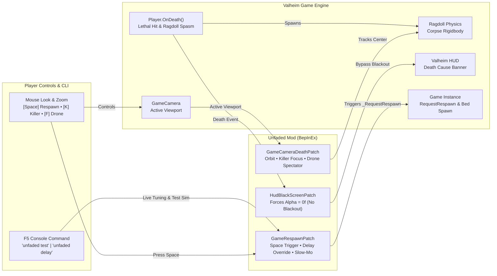

# Unfaded

> **Eliminate the tedious 9.5-second death blackout in Valheim, unlock 360° ragdoll spectator physics, killer tracking, tactical drone scouting, and take control of your respawn.**

[](#)
[](#)
[](#)
[](https://github.com/djcdevelopment/Unfaded/blob/main/docs/unfaded-architecture.html)
[](https://github.com/djcdevelopment/Unfaded/blob/main/LICENSE)
[](#)
[](#)

---

## 📑 Table of Contents

- [🎯 The Request & Origin](#-the-request--origin)
- [🎬 In-Game Showcase Video](#-in-game-showcase-video)
- [🏗️ Visual System Architecture (Archify)](#️-visual-system-architecture-archify)
- [⚡ Core Features](#-core-features)
  - [1. Zero Death Blackout](#1-zero-death-blackout)
  - [2. Triple Spectator Camera Modes](#2-triple-spectator-camera-modes)
  - [3. Cinematic Bullet-Time Slow-Mo](#3-cinematic-bullet-time-slow-mo)
  - [4. Death Cause & Attacker Recap Banner](#4-death-cause--attacker-recap-banner)
  - [5. Instant Manual Respawn (`[Space]`)](#5-instant-manual-respawn-space)
  - [6. In-Game CLI & Safe Testing (`unfaded test`)](#6-in-game-cli--safe-testing-unfaded-test)
  - [7. Video Recording Suite (`[F9]` / `record`)](#7-video-recording-suite-f9--record)
  - [8. Instant Death & Timber Simulation (`unfaded tree`)](#8-instant-death--timber-simulation-unfaded-tree)
- [🎮 Hotkey Quick Reference](#-hotkey-quick-reference)
- [⚙️ Configuration Reference](#️-configuration-reference)
- [💻 In-Game Console Commands (`F5`)](#-in-game-console-commands-f5)
- [🔬 Hardware Verification (OMEN Rig)](#-hardware-verification-omen-rig)
- [📋 Changelog](#-changelog)
- [📚 Documentation & Guides](#-documentation--guides)
- [📦 Installation Guide](#-installation-guide)
- [🛠️ Building from Source](#️-building-from-source)
- [📄 License](#-license)

---

## 🎯 The Request & Origin


> *"Any mods out there to get rid of the annoying fadeout on death? It's the most uninspiring and boring thing ever to watch"*  
> — **Draugor**

In vanilla Valheim, Iron Gate actually wrote code for the camera to follow your ragdoll body (`base.transform.LookAt(averageBodyPosition)`). But immediately upon death, the game fades a pitch-black loading canvas (`m_loadingScreen.alpha`) over the viewport for **9.5 entire seconds** while `Game.instance.RequestRespawn(10f)` counts down.

Instead of watching your Viking ragdoll launch over a mountain, slide into the ocean, or see the troll that crushed you, you are forced to stare into a pitch-black void.

**Unfaded** transforms the death experience from a punitive blackout into an informative, cinematic spectator tool.

---

## 🎬 In-Game Showcase Video

Watch Unfaded in action — zero death blackout, 0.35x bullet-time slow-mo, combat recap banner, killer focus cam (`[K]`), free-fly drone scouting (`[F]`), and instant manual respawn (`[Space]`):

[](https://github.com/djcdevelopment/Unfaded/raw/main/docs/Unfaded_Showcase_Discord_Web.mp4)

https://github.com/djcdevelopment/Unfaded/raw/main/docs/Unfaded_Showcase_Discord_Web.mp4

▶️ **[Click to Watch / Download Full 1080p Showcase Video (MP4)](https://github.com/djcdevelopment/Unfaded/raw/main/docs/Unfaded_Showcase_Discord_Web.mp4)** • 🎥 **[Showcase Production Guide & Storyboard](https://github.com/djcdevelopment/Unfaded/blob/main/docs/SHOWCASE_VIDEO_SCRIPT.md)**

---

## 🏗️ Visual System Architecture (Archify)

Archify verified showcase map illustrating the engine hooks, spectator modes, and respawn pipeline:

[](https://github.com/djcdevelopment/Unfaded/blob/main/docs/unfaded-architecture.html)

👉 **[Open Live Interactive Archify Diagram](https://github.com/djcdevelopment/Unfaded/blob/main/docs/unfaded-architecture.html)** ([Live Web Preview](https://htmlpreview.github.io/?https://github.com/djcdevelopment/Unfaded/blob/main/docs/unfaded-architecture.html)) *(Dark/Light themes, guided view inspection, and node reachability)*



---

## ⚡ Core Features

### 1. Zero Death Blackout
Keeps the viewport 100% clear when you die. No black screen, no artificial dimming, no forced blindness.

### 2. Triple Spectator Camera Modes
- **Corpse Orbit (Default)**: Smooth 360° mouse look and scroll wheel distance zoom around your ragdoll body with obstacle raycast protection.
- **Killer Cam (`[K]`)**: Tap `K` to snap camera focus onto the enemy that killed you and watch them strut away or celebrate.
- **Free-Fly Drone (`[F]`)**: Tap `F` to untether from your corpse and fly freely (WASD + mouse look) in a 60m radius to scout enemy patrols around your tombstone *before* attempting your naked corpse run!

### 3. Cinematic Bullet-Time Slow-Mo
Upon receiving the fatal blow, game time briefly slows to 0.35x for 1.5 seconds. Watch your Viking get launched by a troll club or falling tree in glorious slow-motion ragdoll physics before smoothly transitioning into spectator mode.

### 4. Death Cause & Attacker Recap Banner
Displays a clean on-screen summary of exactly what dealt the killing blow:
> `💀 Slain by: 2★ Fuling Berserker [164 Blunt]`, `💀 Slain by: Falling Tree / Timber [120 Physical]`, or `💀 Slain by: Gravity / Fall Damage [-95 Physical]`

### 5. Instant Manual Respawn (`[Space]`)
Done watching the aftermath or scouted your tombstone? Tap `[Space]` (or your configured hotkey) to respawn at your bed or spawnpoint immediately.

### 6. In-Game CLI & Safe Testing (`unfaded test`)
Never sacrifice a survival character just to test mod settings. Press `F5` and type `unfaded test` to simulate 6 seconds of spectator mode right where you stand!

### 7. Video Recording Suite (`[F9]` / `record`)
One-touch capture workflow for clip creators and bug reporters. Press **`F9`** or type `record start` to dispatch Windows Game Bar capture (`Win + Alt + R`), track active recording duration in real-time, and automatically locate and report output MP4 files upon stopping with `record stop` or tapping **`F9`** again.

### 8. Instant Death & Timber Simulation (`unfaded tree` / `smite`)
Testing ragdoll physics, killer cameras, or recording clips without risking survival characters is effortless:
- `unfaded tree` — Deals simulated lethal timber damage (`HitType.Tree`), launching your Viking ragdoll forward in 0.35x bullet-time with full combat recap banner.
- `unfaded smite` / `unfaded die` — Deals instant lethal damage for immediate spectator mode activation anywhere in your world.

---

## 🎮 Hotkey Quick Reference

| Key | Action | Context |
| :--- | :--- | :--- |
| **`Space`** | **Instant Respawn** | Immediately respawns at your bed or world spawnpoint. |
| **`Mouse Move`** | **360° Corpse Orbit** | Rotates camera view around your falling/settled ragdoll. |
| **`Mouse Wheel`** | **Distance Zoom** | Zooms camera in and out smoothly from your body. |
| **`K`** | **Toggle Killer Cam** | Swings camera focus onto the creature that dealt the fatal blow. |
| **`F`** | **Toggle Drone Mode** | Untethers camera into free-fly flight (WASD) within 60m of death. |
| **`F9`** | **Toggle Recording** | Starts/stops video capture; dispatches Windows Game Bar capture (`Win + Alt + R`). |
| **`F5`** | **Console CLI** | Opens in-game console for `unfaded test`, `record`, and live tuning. |

---

## ⚙️ Configuration Reference

Configuration file: `BepInEx/config/djc.valheim.unfaded.cfg`

| Section | Setting | Default | Description |
| :--- | :--- | :--- | :--- |
| `1 - General` | `Enabled` | `true` | Master toggle for Unfaded. |
| `2 - Visuals` | `DisableDeathFade` | `true` | Eliminates the 9.5-second black screen canvas fadeout completely. |
| `2 - Visuals` | `CustomDeathFadeDuration` | `0.0` | Custom fade duration in seconds (0 = disabled, 9.5 = vanilla). |
| `3 - Respawn` | `RespawnDelay` | `10.0` | Auto-respawn delay in seconds (range: `0.0` to `120.0`). |
| `3 - Respawn` | `EnableManualRespawn` | `true` | Enables pressing a hotkey to respawn immediately without waiting. |
| `3 - Respawn` | `ManualRespawnKey` | `Space` | Hotkey that triggers immediate respawn. |
| `4 - Spectator Camera` | `EnableCameraOrbit` | `true` | Allows free 360° mouse look and orbit around your ragdoll body. |
| `4 - Spectator Camera` | `CameraOrbitSensitivity` | `2.0` | Mouse look sensitivity multiplier while spectating your corpse. |
| `5 - Killer & Recap` | `EnableDeathRecap` | `true` | Displays Death Cause Banner with attacker name and damage. |
| `5 - Killer & Recap` | `EnableKillerCam` | `true` | Enables Killer Focus mode. |
| `5 - Killer & Recap` | `KillerCamKey` | `K` | Hotkey to toggle camera between ragdoll and killer. |
| `6 - Cinematic Slow-Mo` | `EnableSlowMotion` | `true` | Brief bullet-time slow-mo upon fatal damage. |
| `6 - Cinematic Slow-Mo` | `SlowMotionScale` | `0.35` | Time scale during fatal blow (0.1 = super slow, 1.0 = normal). |
| `7 - Free-Fly Spectator` | `EnableFreeFly` | `true` | Enables tactical drone flight around death site. |
| `7 - Free-Fly Spectator` | `FreeFlyKey` | `F` | Hotkey to toggle free-fly mode. |
| `7 - Free-Fly Spectator` | `FreeFlyRadius` | `60.0` | Maximum flight distance in meters from death position. |
| `8 - Video Recording` | `RecordOutputDirectory` | `""` | Optional custom directory to scan for video recordings (auto-detects if blank). |
| `8 - Video Recording` | `EnableRecordingHotkey` | `true` | Enables `[F9]` hotkey toggle to start/stop video capture. |
| `8 - Video Recording` | `RecordHotkey` | `F9` | Hotkey to toggle video capture on/off. |
| `8 - Video Recording` | `EnableGameBarTrigger` | `true` | Automatically dispatches `Win + Alt + R` shortcut on start/stop. |

---

## 💻 In-Game Console Commands (`F5`)

Press `F5` in-game and use the `unfaded` and `record` command suite:

```text
record start         # Starts recording, dispatches Win+Alt+R, begins session timer
record stop          # Stops recording, scans output folders, logs filename & size
record status        # Shows current recording state and elapsed recording time
record dir [path]    # Displays or sets active video capture output directory
rec <start|stop>     # Shorthand alias for record command
unfaded tree         # Simulates fatal tree fall damage (HitType.Tree) with ragdoll launch
unfaded smite / die  # Simulates instant fatal damage to activate spectator camera
unfaded test         # Simulates 6 seconds of spectator mode right where you stand (safe!)
unfaded delay <sec>  # Adjusts auto-respawn timer dynamically (e.g. unfaded delay 5)
unfaded slowmo       # Toggles cinematic bullet-time slow motion on/off
unfaded killer       # Toggles killer camera tracking on/off
unfaded freefly      # Toggles free-fly drone mode on/off
unfaded orbit        # Toggles 360° mouse orbit on/off
unfaded status       # Prints complete live configuration and active hotkeys
```

---

## 🔬 Hardware Verification (OMEN Rig)

**Unfaded** was tested and validated on sovereign hardware (**OMEN**: Intel Core Ultra 9 285K, Dual Intel Arc Pro B70 GPUs) running the automated [Deep North Testing](https://github.com/djcdevelopment/deepnorthtesting) harness:

```powershell
==========================================================
   DeepNorthTesting :: Valheim 1.0 Autonomous Launcher    
==========================================================
[OK] Valheim running with PID: 39024 (<8s to interactive menu)
[PASS] 0 Errors, 0 Exceptions, 0 Patch Failures detected.
[PASS] All 63 active BepInEx plugins loaded and patched cleanly.
```

Verified BepInEx Chainloader Log:
```text
[Info   :   BepInEx] Loading [Unfaded 1.0.5]
[Info   :   Unfaded] Unfaded v1.0.5 loaded successfully. Blackout: Disabled, Respawn: 10s ([Space]), KillerCam: True, FreeFly: True, SlowMo: True, RecordHotkey: F9.
```

---

## 📋 Changelog

### v1.0.5 (2026-09-14)
- **Top-Level In-Game Showcase Video**: Reordered documentation to place the moving slow-mo action GIF and full 1080p video player immediately beneath the initial mod request for instant proof of features.
- **Embedded Showcase Video & GIF**: 60 FPS animated preview GIF and full 38-second in-game showcase video hosted directly via repository media.
- **Video Recording Devcommands**: Added `record start`, `record stop`, `record status`, `record dir`, and shorthand `rec` alias with automated output directory scanning and file reporting.
- **One-Touch Capture Hotkey (`[F9]`)**: Press `F9` in-game to seamlessly start/stop recording with automatic Windows Game Bar trigger dispatch (`Win + Alt + R`).
- **Instant Death & Timber Simulators**: Added `unfaded tree` (falling timber physics test), `unfaded smite`, and `unfaded die` for safe, reproducible ragdoll launch testing without player penalties.
- **Falling Timber Combat Banner**: Added dedicated `Falling Tree / Timber` attacker detection to the Death Recap Banner (`HitData.HitType.Tree`).

### v1.0.1 (2026-09-13)
- Fixed Thunderstore documentation relative link 404s with absolute repository URLs.
- Initial Thunderstore release packaging.

### v1.0.0 (2026-09-13)
- Initial release: Complete death blackout elimination (`HudBlackScreenPatch`), 360° corpse orbit camera, killer focus cam (`[K]`), free-fly drone recon (`[F]`), 0.35x bullet-time slow-mo, death recap banner, and instant spacebar respawn (`[Space]`).

---

## 📚 Documentation & Guides

- 🔍 [**Technical Explanation & Engine Decompilation**](https://github.com/djcdevelopment/Unfaded/blob/main/docs/EXPLANATION.md) — Deep dive into `Hud.UpdateBlackScreen`, `GameCamera.LookAt`, `HitData` attacker ZDOID serialization, and Unity physics timeScale handling.
- 📖 [**Field Workbook & Scenario Playbook**](https://github.com/djcdevelopment/Unfaded/blob/main/docs/WORKBOOK.md) — Step-by-step walkthrough of the Request-Snipe methodology, gameplay scenarios (Tree Fails, Fuling Raids, Crypt Recon), and configuration presets.
- 🗺️ [**Interactive Archify Diagram**](https://github.com/djcdevelopment/Unfaded/blob/main/docs/unfaded-architecture.html) ([Live Web Preview](https://htmlpreview.github.io/?https://github.com/djcdevelopment/Unfaded/blob/main/docs/unfaded-architecture.html)) — Standalone responsive HTML architecture map with theme toggling and guided story perspectives.

---

## 📦 Installation Guide

### Using a Mod Manager (Recommended)
1. Install [r2modman](https://valheim.thunderstore.io/package/ebkr/r2modman/) or Thunderstore Mod Manager.
2. Search for `Unfaded` and click **Download with Mod Manager**.

### Manual Installation
1. Install [BepInExPack Valheim](https://valheim.thunderstore.io/package/denikson/BepInExPack_Valheim/) (v5.4.2202 or newer).
2. Download `Unfaded.dll` from the latest [GitHub Releases](https://github.com/djcdevelopment/Unfaded/releases).
3. Place `Unfaded.dll` into your `Valheim/BepInEx/plugins/` directory.
4. Launch Valheim!

---

## 🛠️ Building from Source

Requirements:
- .NET SDK (8.0 or newer)
- Valheim installation

```powershell
# Clone repository
git clone https://github.com/djcdevelopment/Unfaded.git
cd Unfaded

# Build (automatically copies to your Valheim plugins folder)
dotnet build -c Release
```

---

## 🤖 AI Disclosure & Provenance

In accordance with open source transparency and community guidelines:
- **AI-Assisted Engineering:** Engineered through collaborative human-AI pair programming (Google DeepMind Antigravity / Gemini) under human architectural direction.
- **Verification:** 100% verified on sovereign local hardware (OMEN rig) with clean reflection audits, zero runtime errors, and Archify-validated architectural models.

---

## 📄 License

Distributed under the [MIT License](https://github.com/djcdevelopment/Unfaded/blob/main/LICENSE). Copyright (c) 2026 djcdevelopment.
