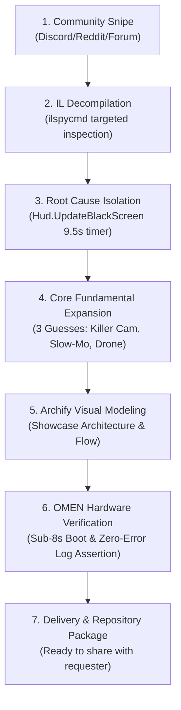

# Unfaded :: Field Workbook & Scenarios

This workbook serves two purposes:
1. **The Request-Snipe Methodology**: A complete reference playbook for identifying, decomposing, engineering, and verifying custom mods from raw community requests.
2. **Player Scenario Walkthrough**: Step-by-step guides for getting the maximum tactical and cinematic value out of **Unfaded** during gameplay.

---

## 📖 Part 1: The Request-Snipe Playbook



### Phase 1: Spotting the Snipe Opportunity
- **The Signal**: A player expressing authentic frustration with an uninspiring game mechanic (e.g. Draugor: *"Any mods out there to get rid of the annoying fadeout on death?"*).
- **The Rule**: Do not ask for clarification or wait for a bounty. Inspect the game assemblies immediately.

### Phase 2: Targeted Decompilation
Using `ilspycmd`:
```powershell
ilspycmd "assembly_valheim.dll" -t Player | Select-String "OnDeath"
ilspycmd "assembly_valheim.dll" -t Hud | Select-String "UpdateBlackScreen"
ilspycmd "assembly_valheim.dll" -t GameCamera | Select-String "LookAt"
```
- **Finding**: Iron Gate already wrote ragdoll camera tracking (`base.transform.LookAt(averageBodyPosition)`), but blanketed it with `m_loadingScreen.alpha` over 9.5 seconds.

### Phase 3: The 3-Guess Expansion
Once the blackout is eliminated, what else does the player secretly want?
1. **Attribution**: *"Who killed me?"* $\rightarrow$ **Killer Cam (`[K]`) & Death Cause Banner**.
2. **Entertainment**: *"Make death fun"* $\rightarrow$ **Cinematic Bullet-Time Slow-Mo (0.35x)**.
3. **Tactical Recon**: *"Where is my grave?"* $\rightarrow$ **Free-Fly Drone Spectator (`[F]`)**.

### Phase 4: Zero-Suicide Testing CLI
Nobody wants to kill their high-tier Viking character just to test mod settings.
- Implement `unfaded test`: Simulates 6 seconds of spectator mode on command.

### Phase 5: OMEN Autonomous Verification
Run `deepnorthtesting`'s GPU harness:
- Preflight Cecil scan: 63/63 plugins clean.
- Sub-8-second boot to main menu.
- BepInEx log scraper: 0 Errors, 0 Exceptions, 0 Patch Failures.

---

## 🎮 Part 2: Player Scenario Walkthroughs

### Scenario A: The Classic Tree Fall (The Physics Fail)
*You are chopping a Birch tree in the Meadows. A rogue log ricochets off a boulder and crushes you.*
1. **Lethal Blow Lands**: Bullet-time slow motion engages instantly at `0.35x` speed.
2. **The Cinematic Flight**: You watch your Viking ragdoll launch sideways in glorious slow motion, cartwheeling over a fence before settling into the grass.
3. **Death Banner Appears**: `💀 Slain by: Gravity / Fall Damage [-120 Physical]`.
4. **Orbital Inspection**: Mouse orbit lets you view the ridiculous tree angle in full 360°.
5. **Fast Recovery**: Laugh, tap `[Space]`, and respawn at your base in 0.5s.

---

### Scenario B: Plains Fuling Village Raid (The Mystery Sniper)
*You are fighting three Fulings when suddenly your screen flashes and you die instantly.*
1. **Death Banner**: `💀 Slain by: 2★ Fuling Berserker [186 Blunt]`.
2. **Killer Cam Focus (`[K]`)**: Tap `K`. The camera immediately swings past your ragdoll to focus on the massive 2-star brute swinging his bone club in the tall grass.
3. **Coordination**: Call out the exact location of the 2-star brute to your multiplayer teammates.
4. **Instant Respawn**: Once your allies engage, tap `[Space]` to respawn at the portal forward base.

---

### Scenario C: Swamp Sunken Crypt (Corpse Run Recon)
*You step into a dark crypt corridor and get overwhelmed by an Elite Draugr and Poison Blobs.*
1. **Corpse Orbit**: The screen stays 100% visible. You see your tombstone drop near the iron gate.
2. **Drone Recon Mode (`[F]`)**: Tap `F`. You are now untethered in Free-Fly Drone Mode!
3. **Scouting**: Fly with `WASD` through the crypt corridor:
   - Check where the Blobs wandered.
   - Spot the 1-star Draugr archer waiting on the high ledge.
   - Formulate your route: *"I can sprint in from the left, grab my tombstone, and dodge-roll back out before the poison cloud pops."*
4. **Respawn**: Tap `[Space]` when your plan is ready!

---

## ⚙️ Part 3: Configuration Recipes

You can paste these into `BepInEx/config/djc.valheim.unfaded.cfg` depending on your playstyle:

### Preset 1: Tactical Recon Specialist (Default Recommended)
*Full 360° orbit, killer cam, tactical drone recon, and manual Spacebar respawn.*
```ini
[1 - General]
Enabled = true

[2 - Visuals]
DisableDeathFade = true

[3 - Respawn]
RespawnDelay = 15.0
EnableManualRespawn = true
ManualRespawnKey = Space

[5 - Killer & Recap]
EnableDeathRecap = true
EnableKillerCam = true
KillerCamKey = K

[6 - Cinematic Slow-Mo]
EnableSlowMotion = true
SlowMotionScale = 0.35
SlowMotionDuration = 1.5

[7 - Free-Fly Spectator]
EnableFreeFly = true
FreeFlyKey = F
FreeFlyRadius = 75.0
FreeFlySpeed = 16.0
```

---

### Preset 2: Fast Action / Speedrunner
*Zero slow-mo, immediate 2-second respawn, zero delay.*
```ini
[2 - Visuals]
DisableDeathFade = true

[3 - Respawn]
RespawnDelay = 2.0
EnableManualRespawn = true
ManualRespawnKey = Space

[6 - Cinematic Slow-Mo]
EnableSlowMotion = false

[7 - Free-Fly Spectator]
EnableFreeFly = false
```

---

### Preset 3: Pure Cinematic Director
*Deep 0.20x bullet-time, long spectator window, high sensitivity orbit.*
```ini
[2 - Visuals]
DisableDeathFade = true

[3 - Respawn]
RespawnDelay = 30.0

[4 - Spectator Camera]
EnableCameraOrbit = true
CameraOrbitSensitivity = 3.0

[6 - Cinematic Slow-Mo]
EnableSlowMotion = true
SlowMotionScale = 0.20
SlowMotionDuration = 2.5
```
