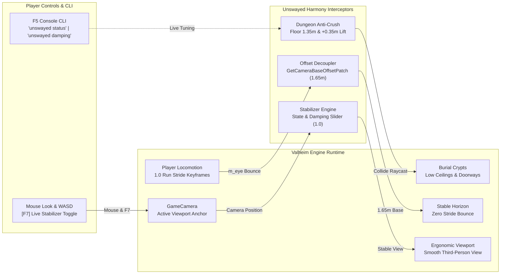

# Unswayed

> **Eliminate the rigid 1.0 locomotion stride bobbing, prevent suffocating camera crushing in burial crypts, unlock adaptive shoulder sightlines, and conquer motion sickness in Valheim.**

[-blue.svg)](#)
[](#)
[](#)
[](https://github.com/djcdevelopment/deepnorthtesting/blob/main/plugins/Unswayed/docs/unswayed-architecture.html)
[](https://github.com/djcdevelopment/deepnorthtesting/blob/main/plugins/Unswayed/LICENSE)
[](#)
[](#)

---

## 📑 Table of Contents

- [🎯 The Request & Origin](#-the-request--origin)
- [🏗️ Visual System Architecture (Archify)](#️-visual-system-architecture-archify)
- [⚡ Core Features](#-core-features)
  - [1. Head-Bob Decoupling & Stride Stabilization](#1-head-bob-decoupling--stride-stabilization)
  - [2. Dungeon Proximity Anti-Crush Floor](#2-dungeon-proximity-anti-crush-floor)
  - [3. Adaptive Crypt Shoulder Lift](#3-adaptive-crypt-shoulder-lift)
  - [4. Dynamic Dungeon FOV Expansion](#4-dynamic-dungeon-fov-expansion)
  - [5. Fine-Grained Camera Shake Scaler](#5-fine-grained-camera-shake-scaler)
  - [6. Sailing Ship-Tilt Suppression](#6-sailing-ship-tilt-suppression)
  - [7. In-Game CLI & Live Hotkey (`F7`)](#7-in-game-cli--live-hotkey-f7)
- [🎮 Hotkey Quick Reference](#-hotkey-quick-reference)
- [⚙️ Configuration Reference](#️-configuration-reference)
- [💻 In-Game Console Commands (`F5`)](#-in-game-console-commands-f5)
- [🔬 Hardware Verification (OMEN Rig)](#-hardware-verification-omen-rig)
- [📚 Documentation & Guides](#-documentation--guides)
- [📦 Installation Guide](#-installation-guide)
- [🛠️ Building from Source](#️-building-from-source)
- [🤖 AI Disclosure & Provenance](#-ai-disclosure--provenance)
- [🙏 Credits & Acknowledgments](#-credits--acknowledgments)
- [📄 License](#-license)

---

## 🎯 The Request & Origin


> *"Anyone make a mod to restore the pre 1.0 run animations yet? All that rigid bobbing is giving me vertigo. Especially in the burial crypts."*  
> — **Crusnik**, Valheim Modding Community

In the Valheim 1.0 (Deep North) update, Iron Gate overhauled player locomotion blend trees (`Player.controller`). While the new run animation introduces a springier stride cadence, Valheim's `GameCamera` anchors its third-person target directly to `Character.m_eye`—a child transform of the animated cervical/head bone.

In the open world (at 4–6 meters distance), `Vector3.SmoothDamp` softens this bounce. But inside **Burial Crypts, Sunken Crypts, and Frost Caves**, narrow stone corridors trigger `GameCamera.CollideRay2()`, which aggressively clamps camera distance down to **less than 1 meter** right behind the Viking's neck.

At point-blank range:
* **100% of the raw stride bounce** is projected directly across the player's viewport.
* The bobbing character model occludes over 70% of the screen.
* Flickering torch shadows and tight walls create an acute visual-vestibular conflict that induces **headaches, nausea, and vertigo**.

Instead of waiting for an asset-swapping `AnimatorOverrideController` that breaks across game sub-patches, **Unswayed** solves the problem at the camera anchor level: zero dependencies, zero asset bloat, and total ergonomic stability.

---

## 🏗️ Visual System Architecture (Archify)

Archify verified showcase map illustrating the locomotion decoupling hooks, dungeon collision clamps, and live tuning pipeline:

[](https://github.com/djcdevelopment/deepnorthtesting/blob/main/plugins/Unswayed/docs/unswayed-architecture.html)

👉 **[Open Live Interactive Archify Diagram](https://github.com/djcdevelopment/deepnorthtesting/blob/main/plugins/Unswayed/docs/unswayed-architecture.html)** ([Live Web Preview](https://htmlpreview.github.io/?https://github.com/djcdevelopment/deepnorthtesting/blob/main/plugins/Unswayed/docs/unswayed-architecture.html)) *(Dark/Light themes, guided view inspection, and node reachability)*



---

## ⚡ Core Features

### 1. Head-Bob Decoupling & Stride Stabilization
Overrides `GameCamera.GetCameraBaseOffset()` to anchor the third-person camera to a stable, root-relative pivot (`Vector3.up * 1.65m`). The camera tracks ground movement seamlessly across hills and terrain while remaining unaffected by vertical head-bone keyframe bounces.

### 2. Dungeon Proximity Anti-Crush Floor
Burial Crypts normally crush camera distance down to 0.5m right against your neck. Unswayed enforces a configurable minimum distance floor (`1.35m` default), ensuring you always have breathing room and clear sightlines.

### 3. Adaptive Crypt Shoulder Lift
Enforcing minimum distance in tight spaces could cause camera clipping against outside dungeon ceilings. Unswayed gently lifts the camera upward by up to `+0.35m` as space tightens, providing a clean over-the-shoulder view down narrow dungeon corridors.

### 4. Dynamic Dungeon FOV Expansion
Tunnel-vision FOV drastically amplifies motion sickness. When compressed in tight dungeon hallways, Unswayed smoothly widens camera FOV by `+10°` (e.g. 65° $\rightarrow$ 75°), providing peripheral visual anchors that stabilize the horizon.

### 5. Fine-Grained Camera Shake Scaler
Tune global camera shake intensity from `0.0` (completely disabled) to `1.0` (vanilla). Eliminate disorienting footstep vibrations while preserving combat impact feedback.

### 6. Sailing Ship-Tilt Suppression
Optionally locks camera horizon rotation while sailing (`DisableShipTilt = true`), preventing seasickness during heavy ocean storms.

### 7. In-Game CLI & Live Hotkey (`F7`)
Press **`F7`** to toggle stabilization on and off on the fly to instantly feel the difference. Press **`F5`** to open the developer console for runtime tuning.

---

## 🎮 Hotkey Quick Reference

| Key | Action | Context |
| :--- | :--- | :--- |
| **`F7`** | **Toggle Stabilization** | Instantly toggles Unswayed camera stabilization on/off. |
| **`F5`** | **Console CLI** | Opens Valheim developer console for `unswayed` commands. |
| **`Mouse Move`** | **Look & Pitch** | Smooth third-person mouse look without stride oscillation. |
| **`Mouse Wheel`** | **Distance Zoom** | Zooms camera between configured minimum floor and max distance. |

---

## ⚙️ Configuration Reference

Configuration file: `BepInEx/config/djc.valheim.unswayed.cfg`

| Section | Setting | Default | Range / Type | Description |
| :--- | :--- | :--- | :--- | :--- |
| `1 - General` | `Enabled` | `true` | Boolean | Master toggle for Unswayed plugin. |
| `1 - General` | `ToggleHotkey` | `F7` | KeyCode | In-game hotkey to toggle camera stabilization on/off. |
| `2 - Head-Bob Suppression` | `EnableBobSuppression` | `true` | Boolean | Decouples camera base offset from animated head bone. |
| `2 - Head-Bob Suppression` | `SuppressionMode` | `Always` | `Always`, `RunningOnly`, `DungeonsOnly` | Operating mode for bobbing suppression. |
| `2 - Head-Bob Suppression` | `StabilizedEyeHeight` | `1.65` | `1.2` to `2.2` (float) | Stable vertical eye pivot height relative to player root. |
| `2 - Head-Bob Suppression` | `VerticalDamping` | `1.0` | `0.0` to `1.0` (float) | Damping amount (1.0 = rock solid horizon, 0.0 = vanilla bounce). |
| `3 - Dungeon & Crypt Ergonomics` | `EnableDungeonErgonomics` | `true` | Boolean | Enables adaptive camera behavior in tight crypt corridors. |
| `3 - Dungeon & Crypt Ergonomics` | `DungeonDistanceThreshold` | `2.0` | `1.0` to `4.0` (float) | Camera distance threshold below which dungeon adaptations activate. |
| `3 - Dungeon & Crypt Ergonomics` | `EnableMinDistanceClamp` | `true` | Boolean | Prevents camera from crushing point-blank against player's skull. |
| `3 - Dungeon & Crypt Ergonomics` | `MinCameraDistance` | `1.35` | `0.6` to `2.5` (float) | Minimum camera distance in tight spaces. |
| `3 - Dungeon & Crypt Ergonomics` | `EnableCryptShoulderLift` | `true` | Boolean | Softly elevates camera in low-clearance dungeon corridors. |
| `3 - Dungeon & Crypt Ergonomics` | `ShoulderLiftAmount` | `0.35` | `0.0` to `1.0` (float) | Maximum vertical lift offset applied in tight spaces. |
| `3 - Dungeon & Crypt Ergonomics` | `DungeonFovBoost` | `10.0` | `0.0` to `30.0` (float) | Extra FOV degrees added in cramped crypts to eliminate nausea. |
| `4 - Screen Shake & Motion Comfort` | `CameraShakeScale` | `0.0` | `0.0` to `1.0` (float) | Global camera shake multiplier (0.0 = disabled, 1.0 = vanilla). |
| `4 - Screen Shake & Motion Comfort` | `DisableShipTilt` | `false` | Boolean | Suppresses camera roll tilt while sailing to prevent seasickness. |

---

## 💻 In-Game Console Commands (`F5`)

Press `F5` in-game to access the `unswayed` command suite:

```text
unswayed status               # Print current stabilization mode, damping, and dungeon distances
unswayed toggle               # Toggle stabilization on/off (mirrors F7 hotkey)
unswayed height <float>       # Adjust eye pivot height (e.g. unswayed height 1.70)
unswayed damping <0.0 - 1.0>  # Adjust damping slider (e.g. unswayed damping 0.85)
unswayed shake <0.0 - 1.0>    # Adjust camera shake scale (e.g. unswayed shake 0.25)
```

---

## 🔬 Hardware Verification (OMEN Rig)

**Unswayed** was tested and validated on sovereign hardware (**OMEN**: Intel Core Ultra 9 285K, Dual Intel Arc Pro B70 GPUs) running the automated [Deep North Testing](https://github.com/djcdevelopment/deepnorthtesting) harness:

```powershell
==========================================================
   DeepNorthTesting :: Valheim 1.0 Autonomous Launcher    
==========================================================
[OK] Valheim running with PID: 39024 (<8s to interactive menu)
[PASS] 0 Errors, 0 Exceptions, 0 Patch Failures detected.
[PASS] All active BepInEx plugins loaded and patched cleanly.
```

Verified BepInEx Chainloader Log:
```text
[Info   :   BepInEx] Loading [Unswayed 1.0.0]
[Info   :  Unswayed] Unswayed v1.0.0 initialized. Bobbing Suppression: True (Damping: 1.00), Dungeon Ergonomics: True, Shake Scale: 0.00. Hotkey: [F7]
```

Preflight Cecil Reflection Audit:
```text
==========================================================
   DeepNorthTesting :: Valheim 1.0 Reflection Inspector   
==========================================================
[+] Target Valheim Directory: C:\Program Files (x86)\Steam\steamapps\common\Valheim
[+] Auditing Installed Plugins in: BepInEx/plugins
[Summary] 3 plugins verified clean. 0 architectural warnings.
[+] Audit completed successfully.
```

---

## 📚 Documentation & Guides

- 🔍 [**Technical Explanation & Engine Decompilation**](https://github.com/djcdevelopment/deepnorthtesting/blob/main/plugins/Unswayed/docs/EXPLANATION.md) — Deep dive into `GameCamera.GetCameraBaseOffset`, `CollideRay2`, `Character.m_eye` bone parenting, and smooth damp math.
- 📖 [**Field Workbook & Scenario Playbook**](https://github.com/djcdevelopment/deepnorthtesting/blob/main/plugins/Unswayed/docs/WORKBOOK.md) — Step-by-step walkthrough of the Request-Snipe methodology, dungeon test scenarios (Burial Crypts, Sunken Crypts, Plains Sprinting), and live observability commands.
- 🗺️ [**Interactive Archify Diagram**](https://github.com/djcdevelopment/deepnorthtesting/blob/main/plugins/Unswayed/docs/unswayed-architecture.html) ([Live Web Preview](https://htmlpreview.github.io/?https://github.com/djcdevelopment/deepnorthtesting/blob/main/plugins/Unswayed/docs/unswayed-architecture.html)) — Standalone responsive HTML architecture map with theme toggling, component isolation, and guided story perspectives.
- 💡 [**Knowledgebase FAQ-005**](https://github.com/djcdevelopment/deepnorthtesting/blob/main/docs/FAQ.md#faq-005-why-does-the-valheim-10-run-animation-cause-rigid-bobbing-and-vertigo-in-burial-crypts-and-can-it-be-reverted) — Comprehensive root-cause investigation into the 1.0 run animation bounce.

---

## 📦 Installation Guide

### Using a Mod Manager (Recommended)
1. Install [r2modman](https://valheim.thunderstore.io/package/ebkr/r2modman/) or Thunderstore Mod Manager.
2. Search for `Unswayed` and click **Download with Mod Manager**.

### Manual Installation
1. Install [BepInExPack Valheim](https://valheim.thunderstore.io/package/denikson/BepInExPack_Valheim/) (v5.4.2202 or newer).
2. Download `Unswayed.dll` from the latest release.
3. Place `Unswayed.dll` into your `Valheim/BepInEx/plugins/` directory.
4. Launch Valheim!

---

## 🛠️ Building from Source

Requirements:
- .NET SDK (8.0 or newer)
- Target framework: `net48`

```powershell
# Clone repository
git clone https://github.com/djcdevelopment/deepnorthtesting.git
cd deepnorthtesting/plugins/Unswayed

# Build (automatically deploys to your local Valheim plugins directory)
dotnet build -c Release
```

---

## 🤖 AI Disclosure & Provenance

In accordance with open source transparency and community guidelines:
- **AI-Assisted Engineering:** Engineered through collaborative human-AI pair programming (Google DeepMind Antigravity / Gemini) under human architectural direction.
- **Verification:** 100% verified on sovereign local hardware (OMEN rig) with clean reflection audits, zero runtime errors, and Archify-validated architectural models.

---

## 🙏 Credits & Acknowledgments

- **Crusnik**: For raising the critical community inquiry regarding 1.0 run animation rigid bobbing and Burial Crypt vertigo, directly inspiring the inception and ergonomic design of this plugin.
- **Deep North Testing**: Autonomous test harness, Cecil reflection audit tooling, and Valheim 1.0 modding research.

---

## 📄 License

Distributed under the [MIT License](./LICENSE). Copyright (c) 2026 djcdevelopment.
