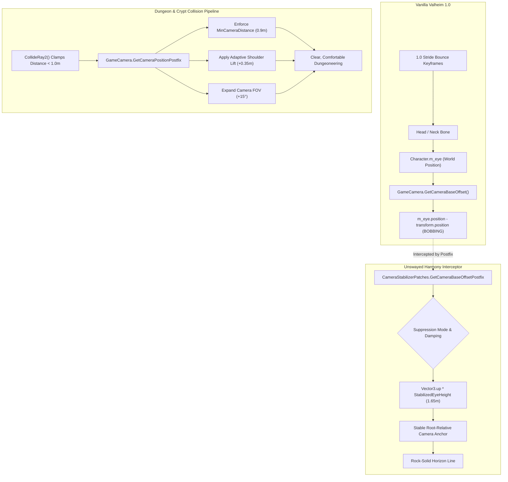

Unswayed (Valheim 1.0)
> **Ergonomic Camera & Locomotion Bobbing Stabilizer for Valheim 1.0 (Deep North).**  
> *Eliminates motion sickness, springy stride bounce, and point-blank dungeon camera crushing in burial crypts.*

[-blue.svg)](#)
[](#)
[](#)

---

## 📑 Table of Contents

- [🌟 The Problem](#-the-problem)
- [🎯 The Solution](#-the-solution)
- [✨ Core Features](#-core-features)
- [⚙️ Configuration Reference](#️-configuration-reference)
- [💻 In-Game Commands & Hotkeys](#-in-game-commands--hotkeys)
- [🏗️ Technical Architecture](#️-technical-architecture)
- [🚀 Quickstart & Installation](#-quickstart--installation)
- [📜 License](#-license)

---

## 🌟 The Problem

In the Valheim 1.0 (Deep North) update, IronGate overhauled character locomotion with a new, springier running animation featuring an exaggerated vertical stride bounce. 

Because the vanilla `GameCamera` anchors its view target directly to `Character.m_eye` (a child of the animated head bone), every stride keyframe oscillates the camera in world space.

While open-world distances (4–6 meters) dampen this oscillation, **Burial Crypts, Sunken Crypts, and Frost Caves** trigger `GameCamera.CollideRay2()`, which crushes camera distance down to **less than 1 meter** right behind the Viking's neck. At point-blank range:
* 100% of the raw vertical animation bounce is translated directly across the player's screen.
* The bobbing character model fills over 70% of the viewport.
* Low-frequency flickering torch shadows and cramped dungeon geometry create an aggressive visual-vestibular mismatch, inducing **severe motion sickness, nausea, and vertigo**.

---

## 🎯 The Solution

**Unswayed** is a lightweight, lean, sovereign mod designed to restore optical stability without sacrificing Valheim's aesthetic:
1. **Decouples Camera from Head Bobbing**: Anchors camera base height to a stable root-relative pivot (`Vector3.up * 1.65m`), completely eliminating the vertical stride bounce while preserving natural mouse look.
2. **Adaptive Dungeon Ergonomics**:
   - **Minimum Distance Clamp**: Prevents camera collision raycasts from crushing point-blank onto the player's skull.
   - **Adaptive Shoulder Lift**: Gently elevates the camera over the Viking's shoulders in narrow corridors, maintaining forward corridor visibility.
   - **Dynamic Dungeon FOV**: Automatically widens the field of view in cramped crypts (e.g. 65° $\rightarrow$ 80°) to stabilize peripheral vision.
3. **Fine-Grained Shake Multiplier**: Tune global camera shake from 0.0 (off) to 1.0 (vanilla) to keep combat impact rumble without stride vibrations.

---

## ✨ Core Features

| Feature | Description | Default |
| :--- | :--- | :---: |
| **Head-Bob Suppression** | Smoothly anchors the camera base height to a stabilized ground offset, decoupling it from the 1.0 animated head bone. | `true` |
| **Suppression Modes** | `Always` (all locomotion), `RunningOnly` (sprinting/running only), or `DungeonsOnly`. | `Always` |
| **Vertical Damping Slider** | Continuous tuning from `1.0` (rock-solid horizon) down to `0.0` (vanilla bounce). | `1.0` |
| **Min Distance Clamp** | Hard floor on camera collision distance in tight crypts (prevents the character from blocking the entire screen). | `0.9m` |
| **Adaptive Shoulder Lift** | Softly raises the camera above the shoulders when compressed by dungeon ceilings. | `+0.35m` |
| **Dungeon FOV Expansion** | Dynamically expands FOV in narrow spaces to eliminate tunnel-vision nausea. | `+15°` |
| **Camera Shake Scaler** | Attenuates camera shake intensity without disabling combat feedback entirely. | `0.0` |
| **Disable Ship Tilt** | Keeps the camera level with the horizon while sailing, preventing seasickness. | `false` |
| **Live Hotkey Toggle** | Instant toggle via `F7` (configurable). | `F7` |

---

## ⚙️ Configuration Reference

File: `BepInEx/config/djc.valheim.unswayed.cfg`

```ini
[1 - General]
## Master toggle for Unswayed camera stabilization.
Enabled = true

## In-game hotkey to quickly toggle camera stabilization on/off.
ToggleHotkey = F7

[2 - Head-Bob Suppression]
## Decouples the camera base offset from the animated head bone, completely eliminating the 1.0 vertical running bounce.
EnableBobSuppression = true

## When to suppress head-bobbing: Always, RunningOnly, or DungeonsOnly.
# Setting type: SuppressionMode
# Acceptable values: Always, RunningOnly, DungeonsOnly
SuppressionMode = Always

## Stable vertical eye pivot height relative to player root transform.
# Setting type: Single
# Acceptable value range: From 1.2 to 2.2
StabilizedEyeHeight = 1.65

## Amount of vertical bobbing suppression (1.0 = completely stable horizon, 0.5 = 50% reduced bounce, 0.0 = vanilla bounce).
# Setting type: Single
# Acceptable value range: From 0 to 1
VerticalDamping = 1

[3 - Dungeon & Crypt Ergonomics]
## Enables adaptive camera behavior when compressed in tight corridors, burial crypts, and sunken crypts.
EnableDungeonErgonomics = true

## Camera distance threshold (meters) below which dungeon/tight-space adaptations activate.
DungeonProximityThreshold = 1.8

## Prevents the camera collision raycast from crushing point-blank into the player's skull.
EnableMinDistanceClamp = true

## Minimum camera distance in tight spaces to prevent the Viking mesh from filling the entire screen.
MinCameraDistance = 0.9

## Gently elevates the camera over the Viking's shoulders when camera distance drops in tight crypts.
EnableCryptShoulderLift = true

## Maximum vertical shoulder lift in tight spaces.
ShoulderLiftAmount = 0.35

## Dynamically expands FOV when navigating tight crypts to widen peripheral vision and reduce nausea.
EnableDungeonFovBoost = true

## Additional FOV degrees added in tight crypt spaces (e.g. 65° -> 80°).
DungeonFovBoost = 15

[4 - Motion Sickness Toggles]
## Global camera shake multiplier (0.0 = completely off, 0.2 = subtle rumble, 1.0 = vanilla full shake).
CameraShakeScale = 0

## Suppresses camera roll/tilt when sailing on boats (prevents seasickness).
DisableShipTilt = false
```

---

## 💻 In-Game Commands & Hotkeys

Open the console (`F5`) and use the `unswayed` command suite:

```text
unswayed status           - Print current camera distance, stabilization mode, and damping state
unswayed toggle           - Toggle stabilization on/off instantly
unswayed height 1.70      - Adjust the stabilized eye height (default: 1.65m)
unswayed damping 0.8      - Adjust vertical damping (0.0 = vanilla bounce, 1.0 = fully rigid)
unswayed shake 0.2        - Adjust camera shake multiplier (0.0 - 1.0)
```

Press **`F7`** at any time during gameplay to immediately toggle stabilization.

---

## 🏗️ Technical Architecture



---

## 🚀 Quickstart & Installation

### Option 1: Automatic via Mod Manager (Recommended)
1. Install via **Thunderstore Mod Manager**, **r2modman**, or **Gale**.
2. Select your profile and launch the game.

### Option 2: Manual Installation
1. Ensure [BepInExPack Valheim](https://thunderstore.io/c/valheim/p/denikson/BepInExPack_Valheim/) is installed.
2. Download `Unswayed.dll`.
3. Place `Unswayed.dll` into your `Valheim/BepInEx/plugins/` directory.
4. Launch Valheim.

---

## 📜 License

Released under the **MIT License**. Created as part of the **Deep North Testing** ecosystem.