# Technical Explanation: Valheim 1.0 Camera Mechanics & Unswayed Architecture

This document details the underlying decompiled mechanics of Valheim 1.0's camera positioning system, the root causes of the severe motion sickness and vertigo reported in Burial Crypts, and how **Unswayed** surgically hooks the game engine to provide a rock-solid, ergonomically comfortable third-person perspective.

---

## 1. The Vanilla Locomotion & Camera Coupling

In Valheim 1.0 (Deep North), Iron Gate introduced overhauled blend trees for humanoid locomotion (`Player.controller`). While pre-1.0 characters maintained a grounded, forward-leaning jog with subtle pelvic sway, the 1.0 locomotion cycle introduces:
- A springier stride cadence with pronounced vertical oscillation along the spine.
- Contact-point keyframe bounces that displace cervical (neck/head) bones by several centimeters on every step.

### The Camera Anchor: `Character.m_eye`
Inside `assembly_valheim.dll`, `GameCamera.cs` calculates its view target via `GetOffsetedEyePos()`:

```csharp
// Source: assembly_valheim.dll -> GameCamera.GetOffsetedEyePos()
private Vector3 GetOffsetedEyePos()
{
    Player localPlayer = Player.m_localPlayer;
    if (!localPlayer)
    {
        return base.transform.position;
    }
    return this.m_playerPos + this.m_currentBaseOffset + this.GetCameraOffset(localPlayer);
}
```

Where `GetCameraBaseOffset()` explicitly tracks the character's eye transform:

```csharp
// Source: assembly_valheim.dll -> GameCamera.GetCameraBaseOffset()
private Vector3 GetCameraBaseOffset(Player player)
{
    if (player.InBed())
    {
        return player.GetHeadPoint() - player.transform.position;
    }
    if (player.IsAttached() || player.IsSitting())
    {
        return player.GetHeadPoint() + Vector3.up * 0.3f - player.transform.position;
    }
    // Normal standing/running locomotion:
    return player.m_eye.transform.position - player.transform.position;
}
```

In the `Player.prefab` hierarchy, `m_eye` is parented directly to the **Head/Neck bone transform**. Every time the running animation keyframes dip or raise the head bone during a stride, `m_eye.transform.position` moves in world space, continuously displacing the camera's target focus.

---

## 2. The Burial Crypt Collision Trap (`CollideRay2`)

Under normal open-world exploration (Meadows, Plains, Ocean), the player sets camera distance between `4.0m` and `6.0m`. `GameCamera.UpdateBaseOffset()` applies a smooth spring damper:

```csharp
this.m_currentBaseOffset = Vector3.SmoothDamp(
    this.m_currentBaseOffset, 
    cameraBaseOffset, 
    ref this.m_offsetBaseVel, 
    0.5f,    // 0.5s smooth time
    999f, 
    dt
);
```

At 5 meters distance, the angular deflection produced by a 5cm vertical stride bounce is less than $0.5^\circ$, which the eye easily absorbs.

### The Raycast Clamping Disaster
When entering a **Burial Crypt**, **Sunken Crypt**, or **Frost Cave**, `GameCamera.GetCameraPosition()` executes obstacle raycasting:

```csharp
// Source: assembly_valheim.dll -> GameCamera.GetCameraPosition()
this.CollideRay2(eyePos, targetCameraPos, ref clampedCameraPos);
```

Dungeon corridors and doorways have ceiling clearances as low as `2.2m` and widths under `2.0m`. The raycast detects impending clipping against dungeon stone arches and pushes the camera forward, crushing camera distance down to **`0.5m – 0.9m`**.

At point-blank range:
1. **Geometric Magnification**: Angular displacement across the player's field of view increases by an order of magnitude ($\approx 6.0^\circ – 8.5^\circ$ of vertical screen oscillation per step).
2. **Viewport Occlusion**: The bouncing character mesh expands to occupy **over 70% of the screen**.
3. **Vestibular-Visual Conflict**: In dark crypts illuminated by low-frequency flickering torchlights (`PointLight`), the brain attempts to track rapid vertical oscillations without a stable horizon line, triggering immediate nausea, eye strain, and vertigo.

---

## 3. How Unswayed Restores Ergonomic Stability

Unswayed intercepts Valheim's camera calculations with surgical precision:

```mermaid
flowchart TD
    subgraph Vanilla ["Vanilla Valheim 1.0 (Vertigo Flow)"]
        A["1.0 Run Animation Keyframes"] -->|"Vertical Stride Bounce"| B["Neck/Head Bone (m_eye)"]
        B -->|"Shifting Target"| C["GameCamera Base Offset"]
        C -->|"CollideRay2() in Crypts"| D["Crushed Distance (<0.8m)"]
        D --> E["100% Raw Bobbing Across Viewport (VERTIGO)"]
    end

    subgraph Unswayed ["Unswayed Architecture (Stabilized Flow)"]
        F["Player Root Transform"] -->|"Fixed Height (1.65m)"| G["BaseOffsetPatch (Postfix)"]
        G -->|"Smooth Damped Horizon"| H["GameCamera Base Offset"]
        H -->|"Proximity Detection"| I["GetCameraPositionPatch"]
        I -->|"Floor Clamp: Min 1.35m"| J["Anti-Crush Distance"]
        I -->|"Adaptive Lift: +0.35m"| K["Over-the-Shoulder Clearance"]
        H -->|"Dynamic FOV Patch"| L["+10° Peripheral Anchor"]
        J & K & L --> M["Rock-Solid, Comfortable Viewport"]
    end
```



### 1. Root Height Decoupling (`GameCameraBaseOffsetPatch`)
Instead of reading `m_eye.transform.position`, Unswayed anchors the camera base height to a stable root-relative pivot (`Vector3.up * StabilizedEyeHeight`):
```csharp
[HarmonyPostfix]
public static void Postfix(Player player, ref Vector3 __result)
{
    if (player.InBed() || player.IsAttached() || player.IsSitting()) return;

    Vector3 targetOffset = Vector3.up * PluginConfig.StabilizedEyeHeight.Value;
    float damping = PluginConfig.VerticalDamping.Value;
    __result = Vector3.Lerp(__result, targetOffset, damping);
}
```
*Result*: The camera tracks the Viking's forward locomotion cleanly across terrain while remaining completely stationary relative to the running stride bounce.

### 2. Dungeon Proximity Anti-Crush (`GameCameraPositionPatch`)
When dungeon colliders force the camera forward, Unswayed prevents it from crushing against the player's skull:
```csharp
if (PluginConfig.EnableMinDistanceClamp.Value)
{
    float minDistance = PluginConfig.MinCameraDistance.Value; // 1.35m
    if (actualDist < minDistance)
    {
        pos = eyePos - dir * minDistance;
    }
}
```

### 3. Adaptive Crypt Shoulder Lift
To prevent wall clipping while maintaining sightlines over the Viking's head down narrow crypt hallways, Unswayed softly applies a distance-proportional vertical lift:
```csharp
if (PluginConfig.EnableCryptShoulderLift.Value)
{
    float compressionRatio = Mathf.Clamp01((2.0f - actualDist) / 1.5f);
    pos += Vector3.up * (PluginConfig.ShoulderLiftAmount.Value * compressionRatio);
}
```

### 4. Dynamic Dungeon FOV Boost (`GameCameraUpdateFovPatch`)
In cramped corridors, narrow FOV creates tunnel vision. Unswayed expands FOV smoothly by `+10°` whenever camera distance drops below `2.0m`, expanding peripheral awareness and stabilizing vestibular orientation.
