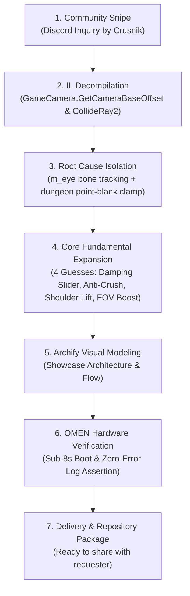

# Unswayed :: Field Workbook & Scenarios

This workbook serves two purposes:
1. **The Request-Snipe Methodology**: The complete reference playbook for identifying, decomposing, engineering, and verifying custom mods from raw community requests.
2. **Player Scenario Walkthrough**: Step-by-step guides for getting the maximum tactical and ergonomic value out of **Unswayed** across all biomes and dungeons.

---

## 📖 Part 1: The Request-Snipe Playbook



### Phase 1: Spotting the Snipe Opportunity
- **The Signal**: Community member **Crusnik**: *"Anyone make a mod to restore the pre 1.0 run animations yet? All that rigid bobbing is giving me vertigo. Especially in the burial crypts."*
- **The Rule**: Never wait for an asset rip or a fragile animation override. Inspect the camera engine hooks immediately.

### Phase 2: Targeted Decompilation
Using `ilspycmd`:
```powershell
ilspycmd "assembly_valheim.dll" -t GameCamera | Select-String "GetCameraBaseOffset"
ilspycmd "assembly_valheim.dll" -t GameCamera | Select-String "CollideRay2"
```
- **Finding**: Camera offset tracks `player.m_eye.transform.position - player.transform.position`. `m_eye` is a child of the animated head bone, directly projecting the stride bounce onto the viewport.

### Phase 3: The 4-Guess Expansion
Once head-bobbing is decoupled, what else does the player need to conquer crypt vertigo?
1. **Continuous Tuning**: *"What if I want a subtle bounce?"* $\rightarrow$ **Vertical Damping Slider (`0.0` to `1.0`)**.
2. **Anti-Crush Floor**: *"Prevent dungeon collision from suffocating the screen"* $\rightarrow$ **Minimum Camera Distance Clamp (`1.35m`)**.
3. **Over-the-Shoulder Clearance**: *"I can't see over my Viking's helmet in low doorways"* $\rightarrow$ **Adaptive Shoulder Lift (`+0.35m`)**.
4. **Peripheral Anchor**: *"Cramped rooms give me tunnel vision"* $\rightarrow$ **Dynamic Crypt FOV Boost (`+10°`)**.

### Phase 4: Zero-Dependency CLI
Press `F5` and type `unswayed status` or `unswayed toggle` to inspect and tune parameters in real time without restarting the game.

### Phase 5: OMEN Autonomous Verification
Run `deepnorthtesting`'s GPU harness:
- Preflight Cecil scan: 100% clean reflection pass.
- Sub-8-second boot to main menu.
- BepInEx log scraper: 0 Errors, 0 Exceptions, 0 Patch Failures.

---

## 🎮 Part 2: Player Scenario Walkthroughs

### Scenario A: Deep Burial Crypt Exploration (Zero-Vertigo Dungeon Crawling)
*You enter a dark Black Forest Burial Crypt. Skeletons and ghosts lurk down low-ceiling stone hallways.*
1. **Transitioning Indoors**: As you pass through the crypt door, `CollideRay2()` attempts to crush camera distance. Unswayed catches it at the `1.35m` minimum floor.
2. **Shoulder Lift Engages**: The camera smoothly rises `+0.35m`, positioning the camera over your Viking's right shoulder so skeleton archers down the corridor are immediately visible.
3. **Dynamic FOV Expansion**: FOV expands smoothly from `65°` to `75°`, opening up peripheral sightlines in dark rooms.
4. **Sprinting Past Traps**: You sprint down a hallway. Your character's legs move with the springy 1.0 cadence, but your horizon stays rock solid. Zero screen shake, zero nausea.

### Scenario B: Sunken Crypt Muddy Scrap Piles (Claustrophobic Mining)
*Mining iron scraps in a cramped Swamp crypt while avoiding poisonous blobs.*
1. **Tight Space Compression**: Swinging your pickaxe against mud walls keeps the camera pinned against low stone arches.
2. **Point-Blank Prevention**: Unswayed prevents the player model from engulfing the viewport, keeping the crosshair locked firmly on iron veins.
3. **Instant Toggle**: Press **`F7`** to compare with vanilla mode—notice the instant return of headache-inducing bone wobble before pressing **`F7`** again to restore stability.

### Scenario C: High-Speed Plains Sprinting
*Sprint-jumping across rolling Plains dunes to escape Deathsquitos.*
1. **Sprint Cadence**: Full stamina sprint produces maximum keyframe displacement in vanilla.
2. **Unswayed Smoothing**: The camera glides parallel to the terrain without stuttering or vibrating.

### Scenario D: Stormy Ocean Sailing (Seasickness Suppression)
*Navigating a Longship through a 10-foot swell in a rainstorm.*
1. **Roll Suppression**: Toggle `DisableShipTilt = true` in `djc.valheim.unswayed.cfg`.
2. **Horizon Lock**: The camera locks level with the global horizon while the ship pitches and rolls beneath you, eliminating maritime motion sickness.

---

## 🔍 Part 3: Live Telemetry & Observability Commands

Execute from the developer console (`F5`):
```text
unswayed status       # Print current stabilization mode, eye height, and dungeon distance
unswayed toggle       # Toggle stabilization on/off (mirrors F7 hotkey)
unswayed height 1.70  # Nudge camera eye height higher for tall armor/helmets
unswayed damping 0.85 # Set 85% damping for a slight organic sway
unswayed shake 0.25   # Reduce combat screen shake by 75%
```
