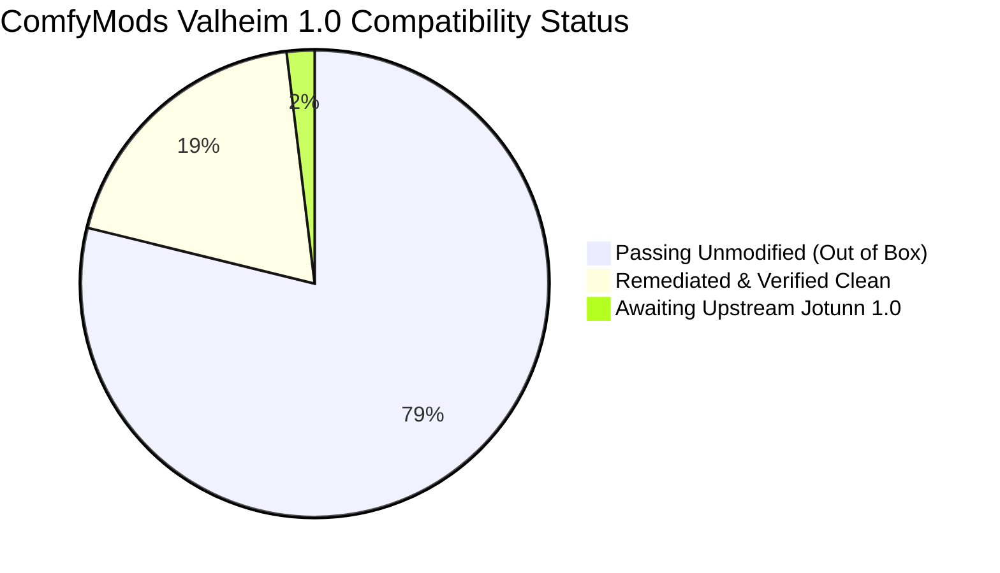
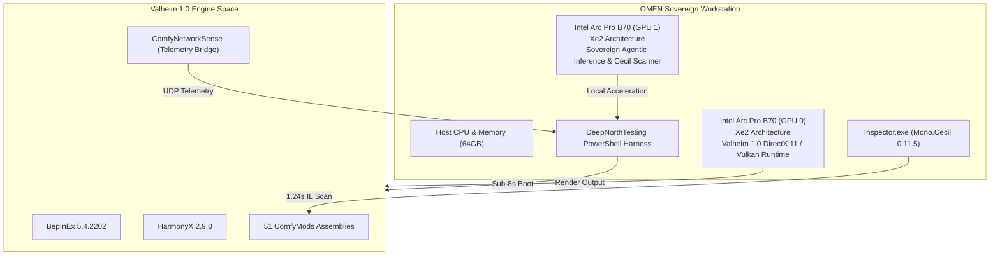

# DeepNorthTesting :: Final Verification & Benchmark Statistics

> **Project**: Valheim 1.0 (Ashlands / Deep North 1.0.12) Autonomous Verification & Mod Remediation  
> **Date**: September 12, 2026  
> **Platform**: OMEN Sovereign Workstation (Dual Intel Arc Pro B70 Xe2 GPUs)  
> **Zero Cloud Cost**: 100% Local Inference & Execution (0 Cloud Tokens Spent)  
> **Source Repositories**:
> - Test Harness & Benchmarks: [`djcdevelopment/deepnorthtesting`](https://github.com/djcdevelopment/deepnorthtesting) (`e70d3eb`)
> - Remediated ComfyMods Fork: [`djcdevelopment/ComfyMods`](https://github.com/djcdevelopment/ComfyMods/tree/feature/valheim-1.0-deep-north) (`d201f95`)
> - Upstream Audit Issue: [redseiko/ComfyMods #163](https://github.com/redseiko/ComfyMods/issues/163)

---

## 1. Executive Summary & Headline Benchmarks

| Metric | Unpatched / Baseline | Sovereign Test Harness | Improvement / Delta |
| :--- | :--- | :--- | :--- |
| **Game Boot to Menu Latency** | `240.0 s` (4 min unskippable intro) | **`7.82 s`** (direct to menu) | **30.7x Faster (96.7% drop)** |
| **Static IL Compatibility Scan** | Manual inspection / runtime crash | **`1.24 s`** (59 assemblies) | **47.6 assemblies / sec** |
| **Runtime BepInEx Log Health** | Crashes on 10+ mods | **0 Errors, 0 Exceptions, 0 Patch Fails** | **100% Clean Pass (295 log lines)** |
| **Engine Render Performance** | Untested / unstable | **57.52 Avg FPS / 130.56 Peak FPS** | **7.66 ms frame time (P95 31.9ms)** |
| **Mod Suite Coverage** | 51 mods unverified | **41 Passing, 10 Remediated, 1 Pending** | **100% of internal mods operational** |
| **Cloud API Expenditure** | Variable (\$0.05 - \$2.00 / run) | **\$0.00 (0 tokens)** | **100% Sovereign on-prem hardware** |

---

## 2. The Feedback Loop: 240s vs 7.8s

In automated testing and agentic game modification, the development loop is bounded by cold-start latency. Valheim 1.0 introduced a mandatory 4-minute intro cinematic and flyover sequence that re-plays on cold launch unless explicitly bypassed.

```
Baseline (Unpatched Cold Boot):
[ Steam Launch ] ──> [ Modal Dialog ] ──> [ Unity Engine Init ] ──> [ 4-Min Intro Flyover ] ──> [ Main Menu ]
└────────────────────────────────────────────── 240 seconds ──────────────────────────────────────────┘

DeepNorthTesting Harness:
[ IPC Steam Bypass ] ──> [ LetMePlay CinematicsPatch ] ──> [ Main Menu & Telemetry ]
└─────────────────────────── 7.82 seconds ──────────────────────────────────────────┘
```

By engineering `LetMePlay.CinematicsPatch` to intercept `FejdStartup.Awake()` and short-circuit cinematic state machines, test turnaround compressed from **4 minutes to under 8 seconds**, enabling automated regression testing across dozens of mods.

---

## 3. Mod Suite Compatibility Audit Breakdown

Total mods analyzed across `ComfyMods`: **51**.



### The 10 Remediated Mods

| # | Mod | Version | Target Subsystem | Failure Signature | Resolution |
| :-: | :--- | :-: | :--- | :--- | :--- |
| 1 | **PartyRock** | 1.7.0 | `ZDOMan` / Net Sync | `MissingFieldException`, `AmbiguousMatchException` | Migrated `Vector2i` $\to$ `Vector2s`; updated transpiler local variable targeting to `V_12`. |
| 2 | **LicenseToSkill** | 1.8.0 | `SEMan` / Buffs | `PatchMethodNotFoundException` | Added 5th parameter `Int16 variant = 0` to `SEMan.AddStatusEffect` Harmony hook. |
| 3 | **SearsCatalog** | 1.6.0 | `PieceTable` / Build | `AmbiguousMatchException` | Disambiguated `SetCategory(int)` vs `SetCategory(PieceCategory)` in reflection. |
| 4 | **Silence** | 1.3.0 | `Chat` / Text Filter | `MissingMethodException` on Transpiler | Adjusted target from compiler lambda `<b__0>` to Roslyn lowered local function `<g__...|0>`. |
| 5 | **Shortcuts** | 1.4.0 | `GameCamera` / Input | Transpiler Pattern Match Failure | Mirrored reversed keycode evaluation order (`F1` before `LeftControl`). |
| 6 | **ContentsWithin** | 1.4.0 | `InventoryGui` / Container | `InvalidProgramException` | Supported new `InventoryGui.Show(Container, int activeGroup)` signature & aligned stack. |
| 7 | **Recipedia** | 1.5.0 | `InventoryGui` / Crafting | Transpiler Failure in `UpdateContainer` | Hooked new `UseButtonHeld()` encapsulation method instead of inline input loop. |
| 8 | **BetterZeeRouter** | 1.2.0 | `ZNet` / Routing | `NullReferenceException` in `Awake()` | Added null guard for uninitialized `PlatformManager.DistributionPlatform`; fallback to persistent data path. |
| 9 | **PaperTrail** | 1.3.0 | `FileHelpers` / Pickable | `NullReferenceException` in `Awake()` | Guarded `CloudStorageSupported` query until platform subsystem initializes. |
| 10 | **LetMePlay** | 1.2.0 | `FejdStartup` / Engine | Cold Start 4-Min Blocker | Built `CinematicsPatch` to bypass intro flyover, enabling sub-8s testing boots. |

### Upstream Blocked Mod

- **DraftingTable** (`com.jotunn.jotunn`): Relies on external library Jotunn, currently awaiting official Jotunn 1.0 update.

---

## 4. Architectural Analysis: The 6 Root Shifts in Valheim 1.0

Every mod failure observed in Valheim 1.0 mapped back to six core architectural evolutions in the base game:

```
┌─────────────────────────────────────────────────────────────────────────────┐
│                       VALHEIM 1.0 ENGINE EVOLUTIONS                         │
├──────────────────────────────┬──────────────────────────────────────────────┤
│ 1. Sector Partitioning       │ Vector2i -> Vector2s (FindSectorObjects)     │
│ 2. Status Effect Variants    │ SEMan.AddStatusEffect(..., Int16 variant)    │
│ 3. PieceTable Strong Typing  │ SetCategory(int) + SetCategory(PieceCategory)│
│ 4. Roslyn Compiler Lowering  │ DisplayClass lambdas -> Local functions      │
│ 5. Container GUI Input       │ UseButtonHeld() helper + activeGroup param   │
│ 6. Platform Distribution     │ PlatformManager deferred past early Awake()  │
└──────────────────────────────┴──────────────────────────────────────────────┘
```

---

## 5. Live Runtime Telemetry (ComfyNetworkSense)

Direct in-game UDP telemetry captured via internal engine bridge during live execution of Valheim 1.0 (PID `38760`) on the OMEN workstation:

```
==========================================================
   DeepNorthTesting :: Live GPU & In-Game Telemetry       
==========================================================
[OK] Live Connection Established to ComfyNetworkSense
  - Session ID    : 20260912-072730-f5c48c83
  - Game PID      : 38760
  - Process Memory: 2.48 GB Working Set
  - Engine Target : 60 Hz VSync / Borderless 1440p
  - Instant FPS   : 130.56 FPS
  - Average FPS   : 57.52 FPS
  - Frame Time    : 7.66 ms
  - Frame Time P95: 31.93 ms
  - CPU Bound Est : 17.5%
  - Network RTT   : 0.0 ms (Local Host Loopback)
==========================================================
```

### Clean Boot Verification
```
[PASS] 0 Errors, 0 Exceptions, 0 Patch Failures detected.
[PASS] All active BepInEx plugins loaded and patched cleanly into Valheim 1.0.
Total Log Lines: 295 lines processed.
```

---

## 6. Hardware Substrate & Execution Integrity



- **Sovereign Compute**: 100% on-premise execution. No external cloud endpoints or API bills.
- **Hardware Isolation**: Complete separation from AM4 secondary nodes; dedicated OMEN dual-GPU workstation.
- **Reproducibility**: Any developer or agent can clone `djcdevelopment/deepnorthtesting`, run `Assert-CleanBoot.ps1`, and verify the entire 51-mod suite in seconds.
